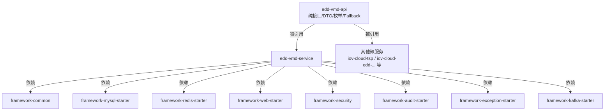
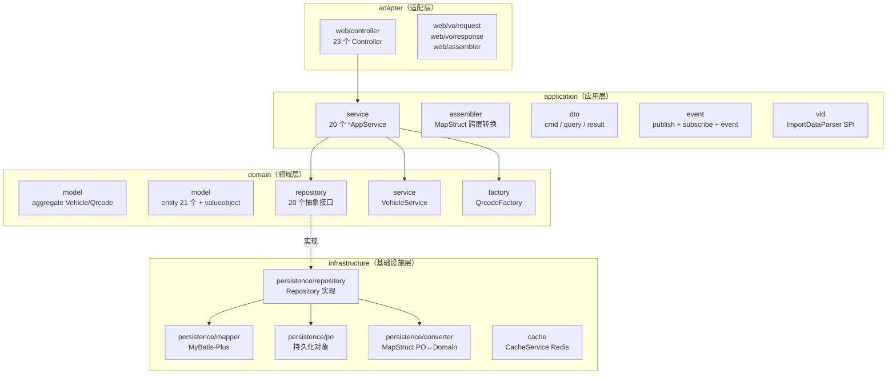
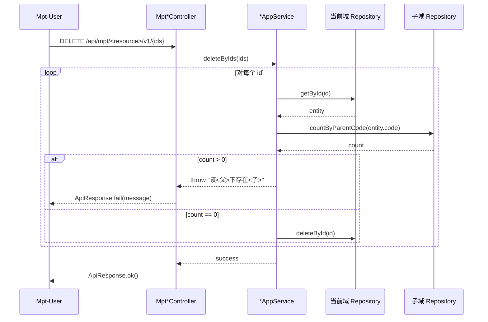
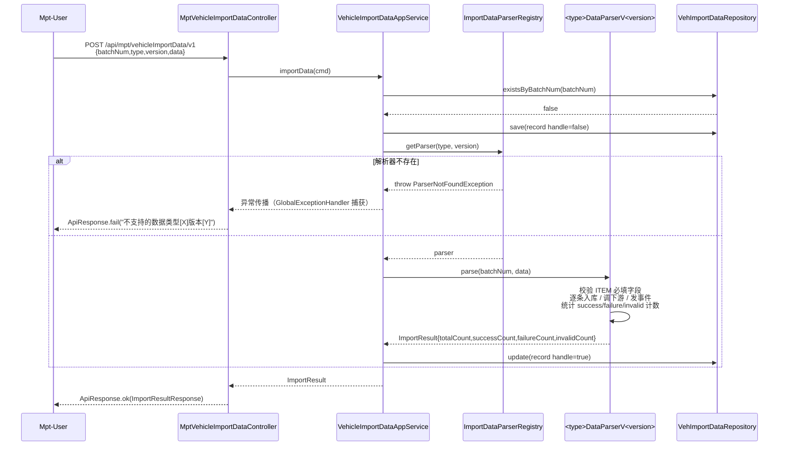
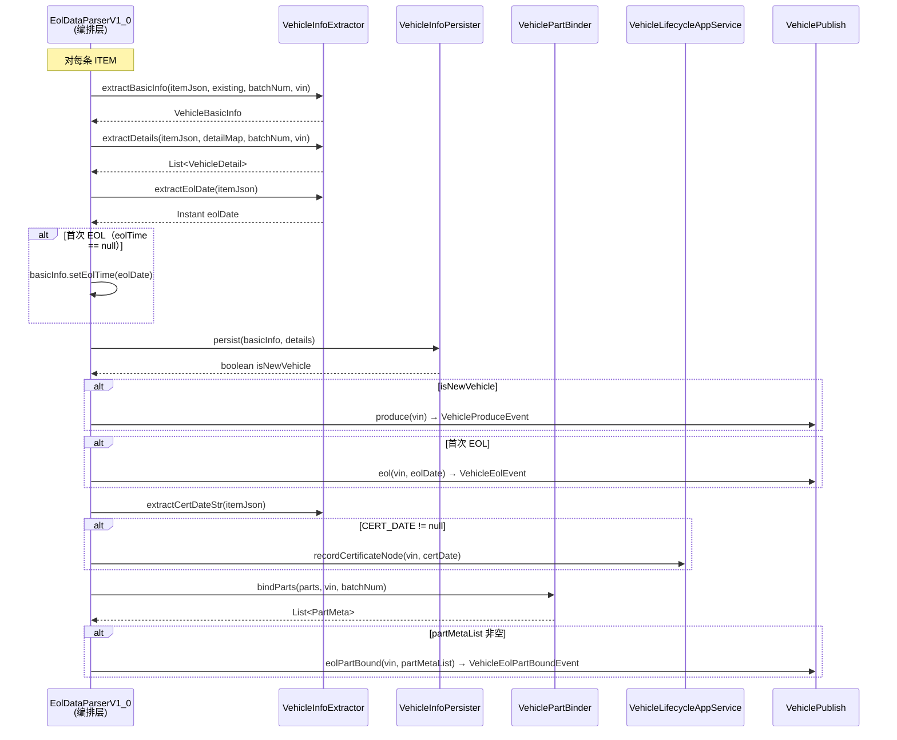
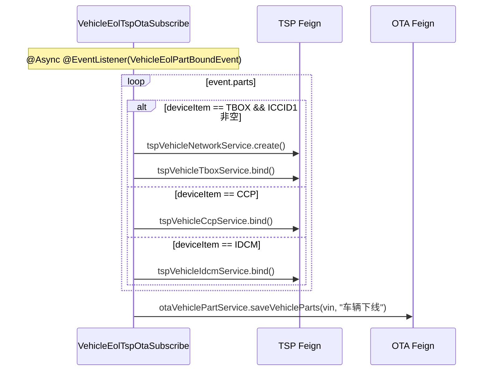
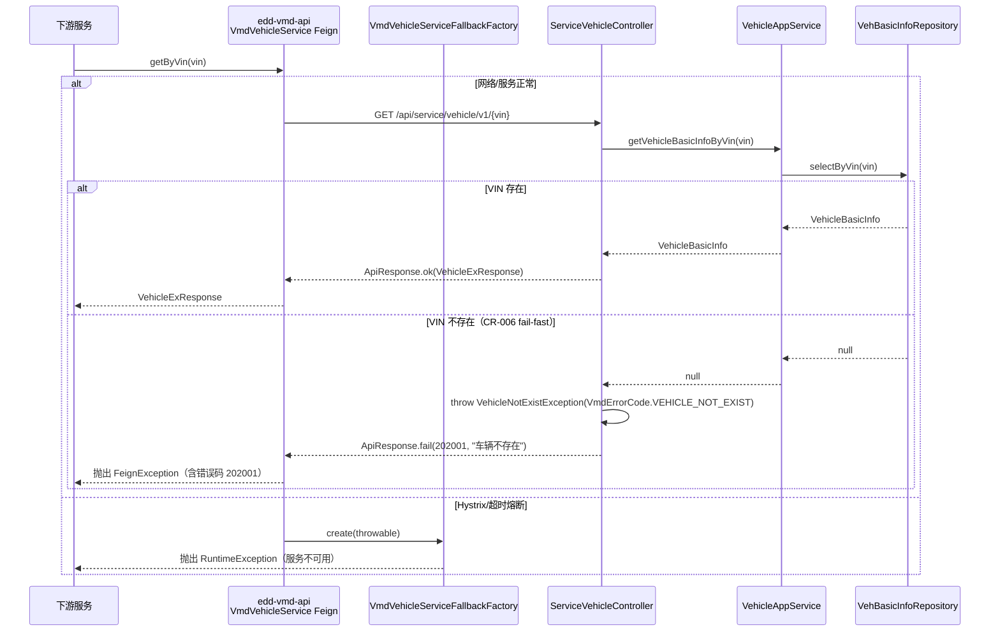
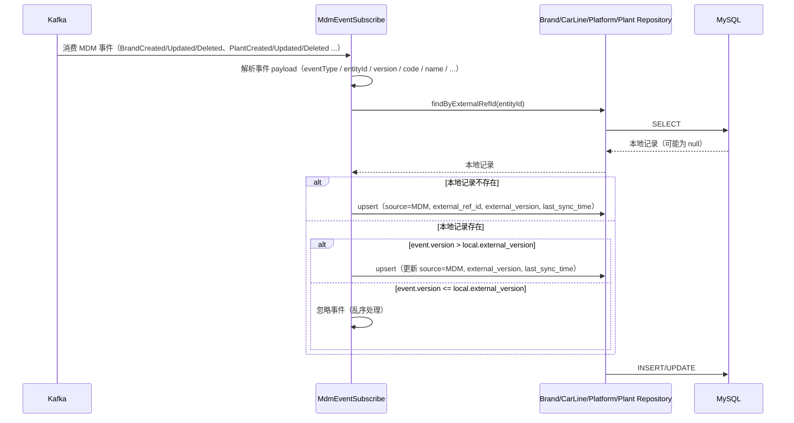
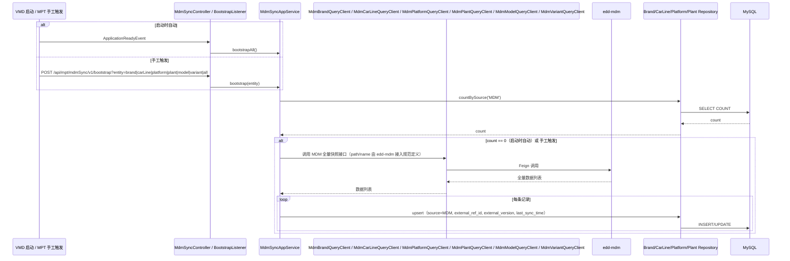

# Vehicle Master Data Platform - Design

> 本文档基于 `requirements.md` (CR-001 + CR-002) 产出。所有章节通过 §6 Coverage Mapping 显式回链到 US-ID。
> 任何后续变更必须遵循 SPEC_GUIDE §6 变更管理规则。

## 1. Architecture Overview

### 1.1 系统上下文

```mermaid
graph LR
    subgraph "上游调用方"
        MDM[edd-mdm<br/>Product MDM 子域]
        MPT[Mpt 后台<br/>completeVehicle:* / iov:configCenter:*]
        TSP_C[TSP 服务<br/>记录证书/密钥节点]
        OTH_C[其他下游<br/>OTA/订单/账号 等]
    end

    GW[API Gateway<br/>鉴权/限流/审计]

    subgraph "edd-vmd 微服务"
        API[edd-vmd-api<br/>Feign 契约 + Fallback]
        SVC[edd-vmd-service<br/>DDD 四层实现]
    end

    subgraph "下游调用方（被 edd-vmd 主动调用）"
        TSP_D[TSP 服务<br/>TspVehicleNetwork/Tbox/Ccp/Idcm/...]
        OTA[OTA 服务<br/>OtaVehiclePartService]
        IDK[IDK 服务<br/>IdkBtmInfoService]
        ACC[(账号服务<br/>ExAccountService<br/>当前注释)]
        SK[(安全密钥服务<br/>ExSkService<br/>当前注释)]
    end

    subgraph "基础设施"
        MYSQL[(MySQL 8<br/>Flyway 管理)]
        REDIS[(Redis<br/>缓存)]
        NACOS[(Nacos<br/>注册 + 配置)]
    end

    MDM -.Kafka 事件.-> SVC
    MDM -.Feign 快照.-> SVC
    MPT --> GW
    GW --> SVC
    TSP_C -.Feign.-> API
    OTH_C -.Feign.-> API
    API -.routing.-> SVC

    SVC --> TSP_D
    SVC --> OTA
    SVC --> IDK
    SVC -.x.-> ACC
    SVC -.x.-> SK

    SVC --> MYSQL
    SVC --> REDIS
    SVC --> NACOS
```

### 1.2 模块依赖



### 1.3 DDD 四层



**强分层规则**（PROJECT_GUIDE 硬性约束）：
- adapter 仅依赖 application，禁止直接依赖 domain/infrastructure
- application 仅依赖 domain，禁止持有 PO
- domain 不依赖任何外部框架（仅依赖 framework-common 中的基类如 `BaseDo` / `DomainObj`）
- infrastructure 实现 domain.repository 接口，对外只暴露领域对象

## 2. Tech Stack & Decisions

| # | Decision | Choice | Alternatives | Rationale |
|---|----------|--------|--------------|-----------|
| D1 | 运行时 | JDK 17 | JDK 11 / JDK 21 | 与 `iov-cloud-parent` 父 POM 锁定一致；JDK 17 LTS，支持 record / pattern matching；项目已固化于 `/Library/Java/JavaVirtualMachines/jdk-17.0.1.jdk` |
| D2 | 微服务注册/配置中心 | Nacos（namespace `32c13f29-...`）| Eureka / Consul | 与 `iov-cloud-*` 全家桶统一；支持 namespace 隔离 + 共享 yaml（application/mysql/redis）；`bootstrap.yml` 已锁定 |
| D3 | ORM | MyBatis-Plus + Flyway | JPA / Hibernate | 框架层 `framework-mysql-starter` 已绑定 MyBatis-Plus；SQL 可控；Flyway V0/V1/V2 已落库 |
| D4 | 跨层对象转换 | MapStruct（编译期生成） | BeanUtils / 手写 | 编译期检查 + 零反射，已在 `application/assembler` 与 `infrastructure/persistence/converter` 全面使用 |
| D5 | 架构模式 | DDD 四层 + 仓储模式 | 贫血三层（Controller/Service/DAO） | PROJECT_GUIDE 硬性要求；聚合 `Vehicle`/`Qrcode` 自带行为（如 `bindOrder`、`validate`、`confirm`），避免逻辑下沉到 Service |
| D6 | 分页策略 | PageHelper `startPage()` + `getPageResult()`，下沉 SQL `LIMIT` | `findAll()` + 内存分页 / 自写 OFFSET | PROJECT_GUIDE 反向模式禁止内存分页；MPT 列表需稳定性能 |
| D7 | 域内事件分发 | Spring `ApplicationEventPublisher`（同进程） | Kafka 跨进程异步 | 当前事件链路均在 edd-vmd 内部；生命周期节点写入（PRODUCE/EOL）使用同步 `@EventListener` 确保事务一致性；**EOL 解析器对 TSP/OTA 的下游调用通过 `VehicleEolPartBoundEvent` + `@Async @EventListener` 异步解耦**，下游不可用时不阻塞 EOL 主流程；未来可平滑迁移至 Kafka |
| D8 | 二维码过期机制 | **当前为空实现（已知缺陷，对应 §5 O9）**；`Qrcode.polling()` 方法体仅含注释 "由于 createTime 已移除，polling 逻辑需依赖基础设施层或重新设计，此处暂时移除超时逻辑，待后续完善"；`QrcodeType.VEHICLE_ACTIVE.timeout=1800` 字段已在 `edd-vmd-api` 定义但未被消费 | ① Redis TTL（Key 自动过期） ② 数据库定时扫表 ③ Qrcode 表加 `expireTime` 列 | Rationale：本 spec 为代码现状基线，仅记录缺陷形态，不规定修复方式。备选项均不在当前代码中体现 |
| D9 | 导入解析器 SPI（**CR-008 修订**） | `ImportDataParserRegistry` 自注册表 + `ParserNotFoundException` 异常传播 | ① 原 Bean Name 字符串拼接 ② ServiceLoader ③ 策略枚举 | **类型安全**：解析器实现 `getType()`/`getVersion()` 自描述，`@PostConstruct` 自注册到 `ConcurrentHashMap<String, ImportDataParser>`；运行时通过 `registry.getParser(type, version)` 类型安全获取，编译期约束 `ImportDataParser` 接口。**错误可感知**：解析器缺失时抛 `ParserNotFoundException`（`VmdErrorCode.PARSER_NOT_FOUND`，错误码 `202013`），由框架统一异常处理链路捕获返回前端，不再静默 `handle=false`。**扩展性不变**：新增解析器仍只需实现接口 + 注册 Bean，零侵入。**CR-009 修订**：`parse()` 返回 `ImportResult`（`totalCount/successCount/failureCount/invalidCount`），Controller 响应携带结构化处理摘要，运营可对账 |
| D10 | Feign 契约策略（**CR-006 修订**） | 强类型 DTO + `*FallbackFactory` + VIN 不存在抛 `VehicleNotExistException` | 返回 `null` / 返回 `Optional<T>` | **fail-fast 原则**：VIN 不存在时抛 `VehicleNotExistException`（`VmdErrorCode.VEHICLE_NOT_EXIST`，错误码 `202001`），由 `GlobalExceptionHandler` 统一捕获返回 `ApiResponse.fail`；`VmdBaseException` 继承 `BusinessException` 以纳入框架统一异常处理链路；Fallback 仅处理基础设施故障（网络/超时），此时抛 `RuntimeException` 让调用方感知服务不可用 |
| D11 | `Vehicle.isActive()` 实现 | **硬编码 `return true`（已知缺陷，对应 §5 O6）**；导致所有 VIN 在 `generateActiveQrcode` 都被判定为已激活并抛 `VehicleHasActivatedException` | ① 查询 `VehicleLifecycleNode` 表是否存在 `VEHICLE_ACTIVE` 节点 ② 通过 qrcode CONFIRMED 判定 ③ 在 `Vehicle` 表加 `active` 状态列 | Rationale：本 spec 为代码现状基线，仅记录缺陷形态。激活的真实判定规则未在当前代码中实现 |
| D12 | IMMO_SK 死代码现状 | `VehicleSkSubscribe` 类整体注释 + `ExSkService` import 注释 + 事件订阅方法体注释；`recordGenerateVehicleSkNode` 永不被触发 | — | Rationale：本 spec 为代码现状基线，仅记录现状形态（死代码保留），不规定处理方式（删除/恢复/标 Deprecated 等改造均需走单独 CR） |
| D13 | MDM 同步策略 | Kafka 事件订阅为主 + Feign 全量快照兜底 + 本地 source 字段标注来源 | ① 仅 Feign 轮询 ② 仅 Kafka 事件 ③ 数据库 CDC | **解耦**：Kafka 事件异步消费，MDM 不可用时不阻塞 VMD 主流程。**可重放**：Kafka 事件支持 offset 回溯重放。**支持降级**：MDM 不可达时降级为只读，source=MANUAL 记录仍可本地维护。**幂等**：通过 external_ref_id + external_version 保证 upsert 幂等性。**适用实体（CR-011/CR-015/CR-016 扩展）**：品牌 / 车系 / 平台 / **Plant（工厂）**/ **车型（Model）**/ **版本（Variant，原 BaseModel 基础车型）**统一采用本策略。详见「edd-mdm 接入规范」 |
| D14 | Manufacturer→Plant 迁移策略（**CR-011**） | **Flyway 原地重命名** `veh_manufacturer`→`veh_plant`（`code`/`name`→`plant_code`/`plant_name`）+ 补 source 投影字段；车辆主档 `veh_basic_info` 新增 `plant_code` 并从 `manufacturer_code` 回填；旧字段/旧接口兼容期保留 | ① 新建 `veh_plant` 表 + 双写 + 后续删旧表 ② 仅在应用层做 `manufacturer`↔`plant` 别名映射、不改表 ③ 一次性删除 manufacturer 全部痕迹 | **数据零丢失**：`RENAME TABLE` + `UPDATE plant_code=manufacturer_code` 在单次迁移内完成，历史车辆 `plantCode` 可追溯（对应 US-007c）。**渐进式**：`manufacturer_code` 列与旧接口在兼容期保留（标 deprecated），既有调用方不立即失败（对应 requirements §5 O16）。**对齐 MDM 语义**：投影表与车辆字段统一 Plant 命名，消除「MDM=Plant / VMD=Manufacturer」割裂。备选①双写成本高、②不改表会长期保留语义割裂、③一次性删除破坏兼容性——均不取 |
| D15 | Brand 本地投影定位与维护收敛策略（**CR-012**） | **复用 CR-010/V3 已建 source 投影字段（不新增 Flyway 迁移、不重命名 `veh_brand.code`/`name`）** + Brand 定位为 MDM Brand 按需最小化只读投影（VMD Brand ⊂ MDM Brand）+ add/edit/remove 收敛为 source=MANUAL 兼容期遗留 | ① 重命名 `veh_brand.code`→`brand_code`/`name`→`brand_name` 对齐字段表 ② 新建独立 Brand 投影表 ③ 立即删除 add/edit/remove 接口与权限点 | **与 Plant（D14）的关键差异**：Brand 实体命名不变、`brandCode` 关联键不变（requirements 明确「保留 brandCode，不改名、不删除」），**不存在 Manufacturer→Plant 式的命名迁移驱动**，故 CR-012 **不引入表/列重命名与新 Flyway 迁移**，直接复用 CR-010（Flyway V3）已为 `veh_brand` 建好的 `source`/`external_ref_id`/`external_version`/`last_sync_time` 字段；`veh_brand.code` 即车辆主档 `brand_code` 的关联键（充当字段范围原则中的 `brand_code`），`veh_brand.name` 充当 `brand_name`。**按需最小化**：`veh_brand` 仅保留车辆主数据闭环所需字段，可选字段（`deleted`/`enabled`/`status`/`raw_payload`/`extension_json`）按消费场景走独立 CR 增量纳入，不强制与 MDM Brand 主数据模型一致。**渐进收敛**：source=MDM 记录经 `ProductDataReadOnlyException`（`202014`）保持只读；add/edit/remove 仅对 source=MANUAL 过渡数据保留并标 `@Deprecated`，最终下线由后续兼容性清理 CR 完成（对应 US-001c、requirements §5 O24）。备选 ①无命名迁移驱动、徒增兼容与迁移成本；②`veh_brand` 已具备投影能力、无需新表；③破坏既有调用方兼容性——均不取 |
| D16 | Platform 本地投影定位与维护收敛策略（**CR-013**） | **复用 CR-010/V3 已建 source 投影字段（不新增 Flyway 迁移、不重命名 `veh_platform.code`/`name`）** + Platform 定位为 MDM Platform 按需最小化只读投影（VMD Platform ⊂ MDM Platform）+ add/edit/remove 收敛为 source=MANUAL 兼容期遗留 | ① 重命名 `veh_platform.code`→`platform_code`/`name`→`platform_name` 对齐字段表 ② 新建独立 Platform 投影表 ③ 立即删除 add/edit/remove 接口与权限点 | **与 Brand（D15）完全同构、区别于 Plant（D14）的命名迁移**：Platform 实体命名不变、`platformCode` 关联键不变（requirements 明确「保留 platformCode，不改名、不删除」，且作为 `veh_basic_info.platform_code` / `veh_model.platform_code` / `veh_base_model.platform_code` 的平台关联编码长期保留），**不存在 Manufacturer→Plant 式的命名迁移驱动**，故 CR-013 **不引入表/列重命名与新 Flyway 迁移**，直接复用 CR-010（Flyway V3）已为 `veh_platform` 建好的 `source`/`external_ref_id`/`external_version`/`last_sync_time` 字段；`veh_platform.code` 即字段范围原则中的 `platform_code`、`veh_platform.name` 即 `platform_name`。**按需最小化**：`veh_platform` 仅保留车辆主数据闭环所需字段，可选字段（`deleted`/`enabled`/`status`/`raw_payload`/`extension_json`）按消费场景走独立 CR 增量纳入，不强制与 MDM Platform 主数据模型一致。**渐进收敛**：source=MDM 记录经 `ProductDataReadOnlyException`（`202014`）保持只读；add/edit/remove 仅对 source=MANUAL 过渡数据保留并标 `@Deprecated`，最终下线由后续兼容性清理 CR 完成（对应 US-006c、requirements §5 O31）。备选 ①无命名迁移驱动、徒增兼容与迁移成本；②`veh_platform` 已具备投影能力、无需新表；③破坏既有调用方兼容性——均不取 |
| D17 | CarLine 本地投影定位与维护收敛策略（**CR-014**） | **复用 CR-010/V3 已建 source 投影字段（不新增 Flyway 迁移、不重命名 `veh_carLine.code`/`name`）** + 保留 CR-002/V2 引入的 `brand_code` 冗余字段 + CarLine 定位为 MDM CarLine 按需最小化只读投影（VMD CarLine ⊂ MDM CarLine）+ add/edit/remove 收敛为 source=MANUAL 兼容期遗留 | ① 重命名 `veh_carLine.code`→`carLine_code`/`name`→`carLine_name` 对齐字段表 ② 新建独立 CarLine 投影表 ③ 删除 `brand_code` 冗余字段、改由实时 join `veh_brand` ④ 立即删除 add/edit/remove 接口与权限点 | **与 Brand（D15）/ Platform（D16）同构、区别于 Plant（D14）的命名迁移**：CarLine 实体命名不变、`carLineCode` 关联键不变（requirements 明确「保留 carLineCode，不改名、不删除」），**不存在 Manufacturer→Plant 式的命名迁移驱动**，故 CR-014 **不引入表/列重命名与新 Flyway 迁移**，直接复用 CR-010（Flyway V3）已为 `veh_carLine` 建好的 `source`/`external_ref_id`/`external_version`/`last_sync_time` 字段。**CarLine 的特殊点（区别于 Brand / Platform）**：`veh_carLine` 上的 `brand_code` 冗余字段（由 `V2__CarLine_brand_code_migration.sql` 引入）**必须保留、不得删除或弱化**——用于支撑跨域回查，并支撑 US-031 `getBuildConfig` 在响应中按 `carLineCode → brandCode` 补出 `brandCode`（参见 §5.2.5）；故备选③不取。**按需最小化**：`veh_carLine` 仅保留车辆主数据闭环所需字段（至少 `code`/`name`/`brand_code`/`source`/`external_ref_id`/`external_version`/`last_sync_time`），可选字段（`deleted`/`enabled`/`status`/`raw_payload`/`extension_json`）按消费场景走独立 CR 增量纳入，不强制与 MDM CarLine 主数据模型一致。**渐进收敛**：source=MDM 记录经 `ProductDataReadOnlyException`（`202014`）保持只读；add/edit/remove 仅对 source=MANUAL 过渡数据保留并标 `@Deprecated`，最终下线由后续兼容性清理 CR 完成（对应 US-002c、requirements §5 O38）。备选 ①无命名迁移驱动、徒增兼容与迁移成本；②`veh_carLine` 已具备投影能力、无需新表；③破坏跨域回查与 US-031 契约；④破坏既有调用方兼容性——均不取 |
| D18 | Model 本地投影定位与维护收敛策略（**CR-015**） | **新增 Flyway 迁移 `V6__Add_mdm_source_to_model.sql` 为 `veh_model` 补齐 source 投影字段（不重命名 `veh_model` 现有列）** + Model 定位为 MDM Model 按需最小化只读投影（VMD Model ⊂ MDM Model）+ add/edit/remove 收敛为 source=MANUAL 兼容期遗留 + 保留「车系→车型→基础车型」引用链 | ① 复用 V3 现有迁移（不可行：V3 未覆盖 veh_model） ② 重命名 `veh_model` 列对齐字段表 ③ 新建独立 Model 投影表 ④ 立即删除 add/edit/remove 接口与权限点 ⑤ 将 BaseModel 一并投影化 | **与 Brand（D15）/ Platform（D16）/ CarLine（D17）同构、区别于 Plant（D14）的命名迁移**：Model 实体命名不变、`modelCode` 关联键不变（requirements 明确「保留 modelCode，不改名、不删除」），不存在 Manufacturer→Plant 式的命名迁移驱动。**与 Brand/Platform/CarLine 的关键差异**：CR-010（Flyway V3，`V3__Add_mdm_source_to_product_tree.sql`）仅为 `veh_brand`/`veh_series`/`veh_platform` 建好 `source`/`external_ref_id`/`external_version`/`last_sync_time` 字段，**未覆盖 `veh_model`**，故 Brand/Platform/CarLine 可复用 V3，而 CR-015 **必须新增 Flyway 迁移 `V6__Add_mdm_source_to_model.sql`**（幂等 ALTER 补齐上述字段 + `UK(external_ref_id)` + 回填 source='MANUAL'），备选①不可行。**按需最小化**：`veh_model` 仅保留车辆主数据闭环所需字段（至少 `code`/`name`/`platform_code`/`car_line_code`/`source`/`external_ref_id`/`external_version`/`last_sync_time`），可选字段（`deleted`/`enabled`/`status`/`raw_payload`/`extension_json`）按消费场景走独立 CR 增量纳入。**产品树引用链保护**：`veh_base_model.model_code → veh_model.code` 的「车系→车型→基础车型」引用链不得切断，BaseModel 当前仍为 VMD 自有，备选⑤（一并投影化 BaseModel）留待后续 CR-016~018，本 CR 不取。**渐进收敛**：source=MDM 记录经 `ProductDataReadOnlyException`（`202014`）保持只读；add/edit/remove 仅对 source=MANUAL 过渡数据保留并标 `@Deprecated`，最终下线由后续兼容性清理 CR 完成（对应 US-003c、requirements §5 O45）。备选 ②无命名迁移驱动、徒增成本；③`veh_model` 补齐投影字段后已具备投影能力、无需新表；④破坏既有调用方兼容性——均不取 |
| D19 | Variant（原 BaseModel）本地投影定位与命名迁移策略（**CR-016**） | **Flyway 表/键重命名（与 D14 Plant 同构）**：`V7__Migrate_base_model_to_variant.sql` 将 `veh_base_model`→`veh_variant`（保留现有列 `code`/`name`/`platform_code`/`car_line_code`/`model_code` 不变）+ 补 source 投影字段 + `UK(external_ref_id)` + 回填 source='MANUAL'；`V8__Migrate_base_model_code_to_variant_code.sql` 将关联键 `base_model_code`→`variant_code`（`veh_basic_info` 新增 `variant_code` 回填、`veh_build_config` 与 `veh_base_model_feature_code` 列迁移/回填，旧列兼容期保留）。Variant 定位为 MDM Variant 按需最小化只读投影（VMD Variant ⊂ MDM Variant）+ add/edit/remove 收敛为 source=MANUAL 兼容期遗留 | ① 仅在应用层做 `baseModel`↔`variant` 别名映射、不改表 ② 新建独立 `veh_variant` 表 + 双写 + 删旧表 ③ 一次性删除 baseModel 全部痕迹 ④ 复用现有迁移（不可行：`veh_base_model` 无 source 投影字段） ⑤ 将 BaseModelFeatureCode / BuildConfig / FeatureFamily 一并改造 | **与 Plant（D14）同构、区别于 Brand/Platform/CarLine/Model（D15~D18 命名不变、仅投影化）**：本次 MDM 侧实体由 BaseModel 改名为 Variant，存在 Manufacturer→Plant 式的命名迁移驱动，故必须引入表/列重命名与新 Flyway 迁移；区别于 Plant（仅 V5 单迁移）的是 BaseModel 既无投影字段、又涉及关联键 `baseModelCode`→`variantCode`，故拆为 V7（实体投影化 + 表重命名）+ V8（关联键迁移）两步，备选④不可行。**数据零丢失 + 渐进式**：`RENAME TABLE` + `UPDATE variant_code=base_model_code` 在迁移内完成，历史车辆 `variantCode` 可追溯（对应 US-004c）；`base_model_code` 旧列、`/api/mpt/baseModel/**` 旧接口、`completeVehicle:product:baseModel:*` 旧权限点兼容期保留并标 `@Deprecated`（对应 requirements §5 O51）。**按需最小化**：`veh_variant` 仅保留车辆主数据闭环所需字段（至少 `code`/`name`/`platform_code`/`car_line_code`/`model_code`/`source`/`external_ref_id`/`external_version`/`last_sync_time`），可选字段（`deleted`/`enabled`/`status`/`raw_payload`/`extension_json`）按消费场景走独立 CR 增量纳入。**最小化范围**：本 CR 仅处理 BaseModel 本体（投影化 + 改名），BaseModelFeatureCode 仅做引用键 `base_model_code`→`variant_code` 兼容改名（特征值业务语义不变、表名不变），BuildConfig / FeatureFamily 归属改造留待 CR-017/CR-018，**「车系→车型→版本」与 `BuildConfig → variantCode` 引用链不得切断**，备选⑤不取。**渐进收敛**：source=MDM 记录经 `ProductDataReadOnlyException`（`202014`）保持只读；add/edit/remove 仅对 source=MANUAL 过渡数据保留并标 `@Deprecated`，最终下线由后续兼容性清理 CR 完成（对应 US-004c、requirements §5 O47/O51）。备选 ①不改表会长期保留语义割裂；②双写成本高；③一次性删除破坏兼容性——均不取 |

## 3. Data Model

### 3.1 持久化表清单（23 张）

按业务域分组，所有表通过 Flyway V0/V1/V2 创建（V3 引入 MDM source 字段；V4 引入 Plant 迁移，见 §3.4）。

#### 产品树域（10 张）
| 表名 | PO 类 | 关键列 | 唯一约束 | 关联 |
|------|------|--------|----------|------|
| `veh_brand` | `VehBrandPo` | `code`, `name`, `source`, `external_ref_id`, `external_version`, `last_sync_time` | UK(`code`), UK(`external_ref_id`) | MDM Brand 主数据本地投影，按需最小化字段（CR-012）；`code` 为车辆主档 `brand_code` 关联键，沿用不重命名 |
| `veh_carLine` | `VehCarLinePo` | `code`, `name`, `brand_code`, `source`, `external_ref_id`, `external_version`, `last_sync_time` | UK(`code`), UK(`external_ref_id`) | MDM CarLine 主数据本地投影，按需最小化字段（CR-014）；`code` 为车辆主档/产品树 `carLine_code` 关联键，沿用不重命名；`brand_code` 为 CR-002/V2 引入的冗余字段，**必须保留**（跨域回查 + US-031 `getBuildConfig`），source=MDM 时由事件 payload 提供，source=MANUAL 时由 MPT 写入；→ `veh_brand.code` |
| `veh_platform` | `VehPlatformPo` | `code`, `name`, `source`, `external_ref_id`, `external_version`, `last_sync_time` | UK(`code`), UK(`external_ref_id`) | MDM Platform 主数据本地投影，按需最小化字段（CR-013）；`code` 为车辆主档/产品树 `platform_code` 关联键，沿用不重命名 |
| `veh_model` | `VehModelPo` | `code`, `name`, `platform_code`, `carLine_code` | UK(`code`) | → `veh_platform.code`, `veh_carLine.code` |
| `veh_variant` | `VehVariantPo`（原 `VehBaseModelPo`） | `code`, `name`, `platform_code`, `car_line_code`, `model_code`, `source`, `external_ref_id`, `external_version`, `last_sync_time` | UK(`code`), UK(`external_ref_id`) | 由 `veh_base_model` 重命名迁移（CR-016，V7）；MDM Variant（版本，原基础车型）主数据本地投影，按需最小化字段；`code` 为车辆主档/产品树 `variant_code` 关联键（承接原 `base_model_code`），沿用不重命名；→ `veh_model.code` |
| `veh_base_model_feature_code` | `VehBaseModelFeatureCodePo` | `variant_code`（原 `base_model_code`）, `family_code`, `feature_code` | UK(`variant_code`,`family_code`) | → `veh_variant.code`, `veh_feature_family.code`, `veh_feature_code.code`；**CR-016 仅引用键 `base_model_code`→`variant_code` 兼容改名，表名与 BaseModelFeatureCode 实体名不变、特征值业务语义不变**（旧列兼容期保留） |
| `veh_build_config` | `VehBuildConfigPo` | `code`, `name`, `variant_code`（原 `base_model_code`） | UK(`code`) | → `veh_variant.code`；CR-016 引用键 `base_model_code`→`variant_code`（旧列兼容期保留），BuildConfig 本体仍为 VMD 自有（归属改造留待 CR-017） |
| `veh_build_config_feature_code` | `VehBuildConfigFeatureCodePo` | `build_config_code`, `family_code`, `feature_code` | UK(`build_config_code`,`family_code`) | → `veh_build_config.code` |
| `veh_feature_family` | `VehFeatureFamilyPo` | `code`, `name`, `type` | UK(`code`) | — |
| `veh_feature_code` | `VehFeatureCodePo` | `code`, `name`, `family_code` | UK(`code`) | → `veh_feature_family.code` |
| `veh_plant` | `VehPlantPo` | `plant_code`, `plant_name`, `source`, `external_ref_id`, `external_version`, `last_sync_time` | UK(`plant_code`), UK(`external_ref_id`) | 由 `veh_manufacturer` 重命名迁移（CR-011，V4）；MDM Plant 主数据本地投影，按需最小化字段 |

> 注（产品树域）：`veh_manufacturer` 已于 CR-011（Flyway V4）重命名为 `veh_plant`，列 `code`/`name` 重命名为 `plant_code`/`plant_name` 并补充 MDM 投影字段（详见 §3.4 V4、§2 D14）。`veh_plant` 是 MDM Plant 的按需最小化只读投影，不要求与 MDM Plant 主数据字段完全一致（字段范围见 requirements §4「Plant 投影字段范围原则」）；如需 `deleted`/`enabled`/`status`/`raw_payload`/`extension_json` 等可选字段，由消费场景按 CR 增量纳入。

> 注（Brand 投影，CR-012）：`veh_brand` 自 CR-012 起定位为 MDM Brand 主数据在 VMD bounded context 下的**按需最小化只读投影**，不是 MDM Brand 的完整副本/镜像表。与 Plant 不同，Brand 实体命名与 `brandCode` 关联键均不变，故 **CR-012 不引入表/列重命名，也不新增 Flyway 迁移**，直接复用 CR-010（V3）已建的 `source`/`external_ref_id`/`external_version`/`last_sync_time` 字段；`veh_brand.code` 即字段范围原则中的 `brand_code`（车辆主档 `brand_code` 关联键）、`veh_brand.name` 即 `brand_name`。字段范围以车辆查询、车辆详情展示、导入校验、产品树关联、历史追溯为边界，可选字段（`deleted`/`enabled`/`status`/`raw_payload`/`extension_json`）按消费场景走独立 CR 增量纳入（详见 §2 D15、requirements §4「Brand 投影字段范围原则」）。

> 注（Platform 投影，CR-013）：`veh_platform` 自 CR-013 起定位为 MDM Platform 主数据在 VMD bounded context 下的**按需最小化只读投影**，不是 MDM Platform 的完整副本/镜像表。与 Brand 完全同构、区别于 Plant 的命名迁移：Platform 实体命名与 `platformCode` 关联键均不变，故 **CR-013 不引入表/列重命名，也不新增 Flyway 迁移**，直接复用 CR-010（V3）已建的 `source`/`external_ref_id`/`external_version`/`last_sync_time` 字段；`veh_platform.code` 即字段范围原则中的 `platform_code`（车辆主档 `veh_basic_info.platform_code` 及产品树 `veh_model.platform_code` / `veh_variant.platform_code`（原 `veh_base_model.platform_code`，CR-016）的关联键）、`veh_platform.name` 即 `platform_name`。字段范围以车辆查询、车辆详情展示、导入校验、产品树关联、历史追溯为边界，可选字段（`deleted`/`enabled`/`status`/`raw_payload`/`extension_json`）按消费场景走独立 CR 增量纳入（详见 §2 D16、requirements §4「Platform 投影字段范围原则」）。

> 注（CarLine 投影，CR-014）：`veh_carLine` 自 CR-014 起定位为 MDM CarLine 主数据在 VMD bounded context 下的**按需最小化只读投影**，不是 MDM CarLine 的完整副本/镜像表。与 Brand / Platform 同构、区别于 Plant 的命名迁移：CarLine 实体命名与 `carLineCode` 关联键均不变，故 **CR-014 不引入表/列重命名，也不新增 Flyway 迁移**，直接复用 CR-010（V3）已建的 `source`/`external_ref_id`/`external_version`/`last_sync_time` 字段；`veh_carLine.code` 即字段范围原则中的 `carLine_code`（车辆主档/产品树 `carLine_code` 关联键）、`veh_carLine.name` 即 `carLine_name`。**车系区别于 Brand / Platform 投影的特殊点**：`veh_carLine.brand_code` 冗余字段（由 CR-002/V2 `V2__CarLine_brand_code_migration.sql` 引入）属于 VMD 业务闭环必备字段，**必须保留、不得删除或弱化**，用于支撑跨域回查并支撑 US-031 `getBuildConfig` 按 `carLineCode → brandCode` 在响应中补出 `brandCode`（参见 §5.2.5）。其余可选字段（`deleted`/`enabled`/`status`/`raw_payload`/`extension_json`）按消费场景走独立 CR 增量纳入（详见 §2 D17、requirements §4「CarLine 投影字段范围原则」）。

> 注（Variant 投影 + 命名迁移，CR-016）：`veh_variant` 由 `veh_base_model` 经 CR-016（Flyway V7）**重命名迁移**而来（与 Plant/CR-011 同构、区别于 Brand/Platform/CarLine/Model 的命名不变投影化），自此定位为 MDM Variant（版本，原基础车型）主数据在 VMD bounded context 下的**按需最小化只读投影**，不是 MDM Variant 的完整副本/镜像表。表迁移保留现有列 `code`/`name`/`platform_code`/`car_line_code`/`model_code` 不变并补齐 `source`/`external_ref_id`/`external_version`/`last_sync_time` + `UK(external_ref_id)`（V7）；关联键 `base_model_code`→`variant_code` 经 V8 迁移（`veh_basic_info` 新增 `variant_code` 回填、`veh_build_config` 与 `veh_base_model_feature_code` 列迁移/回填，旧列兼容期保留）。**`veh_variant.model_code → veh_model.code` 的「车系→车型→版本（原基础车型）」与 `veh_build_config.variant_code → veh_variant.code` 引用链不得切断**。BaseModelFeatureCode / 特征值业务语义本 CR 不变（仅引用键兼容改名）；BuildConfig / FeatureFamily 归属改造留待 CR-017/CR-018。可选字段按消费场景走独立 CR 增量纳入（详见 §2 D19、requirements §4「Variant 投影字段范围原则」）。

> 注：`source` 字段取值 `MDM` / `MANUAL`，默认 `MANUAL`。`external_ref_id` 存储 MDM 侧实体主键 ID（如 `mdm_brand.id` / `mdm_plant.id`），source=MANUAL 时为 NULL。`external_version` 存储 MDM 侧实体版本号，VMD 收到事件时执行 `IF event.version > local.external_version THEN upsert ELSE ignore`。`last_sync_time` 记录最后一次同步时间。`UK(external_ref_id)` 在 MySQL 中允许多 NULL（source=MANUAL 时自动跳过约束），source=MDM 时 external_ref_id 非空约束生效。`veh_plant` 同样适用本规则（CR-011）。

#### 配置项域（3 张）
| 表名 | PO 类 | 关键列 | 唯一约束 |
|------|------|--------|----------|
| `config_item` | `ConfigItemPo` | `code`, `name` | UK(`code`) |
| `config_item_option` | `ConfigItemOptionPo` | `config_item_code`, `option_code` | UK(`config_item_code`,`option_code`) |
| `config_item_mapping` | `ConfigItemMappingPo` | `config_item_code`, `source_value`, `target_value` | — |

#### 物理车域（5 张）
| 表名 | PO 类 | 关键列 | 唯一约束 | 备注 |
|------|------|--------|----------|------|
| `veh_basic_info` | `VehBasicInfoPo` | `vin`, `plant_code`, `manufacturer_code`(legacy), `brand_code`, `platform_code`, `carLine_code`, `model_code`, `variant_code`, `base_model_code`(legacy), `build_config_code`, `order_num` | UK(`vin`) | 车辆主档；`plant_code` 为生产工厂追溯字段（CR-011，V4），承接 `manufacturer_code` 语义并由其回填；`manufacturer_code` 兼容期保留、标 deprecated，待后续清理 CR 下线；**`variant_code` 为版本关联字段（CR-016，V8），承接 `base_model_code` 语义并由其回填；`base_model_code` 兼容期保留、标 deprecated，待后续清理 CR 下线** |
| `veh_detail_info` | `VehDetailInfoPo` | `vin`, 30+ 详细字段 | UK(`vin`) | EOL 解析时填充 |
| `veh_preset_owner` | `VehPresetOwnerPo` | `vin`, `mobile`, `name` | UK(`vin`) | 预设车主（当前 `checkVehiclePresetOwner` 注释，本期不消费） |
| `vehicle_config` | `VehicleConfigPo` | `vin`, `version` | UK(`vin`,`version`) | 车辆配置版本 |
| `vehicle_config_item` | `VehicleConfigItemPo` | `vin`, `version`, `config_item_code`, `value` | UK(`vin`,`version`,`config_item_code`) | 车辆配置项 |

#### 零件设备供应商域（5 张）
| 表名 | PO 类 | 关键列 | 唯一约束 |
|------|------|--------|----------|
| `part` | `PartPo` | `pn`, `name`, `type`, `device_code`, `supplier_code`, `software` | UK(`pn`) |
| `device` | `DevicePo` | `code`, `name`, `device_item`, `software` | UK(`code`) |
| `supplier` | `SupplierPo` | `code`, `name` | UK(`code`) |
| `vehicle_part` | `VehiclePartPo` | `vin`, `pn`, `sn`, `device_code`, `device_item`, `part_state`, `bind_org`, `bind_time`, `extra` | UK(`pn`,`sn`) |
| `vehicle_part_history` | `VehiclePartHistoryPo` | 同 `vehicle_part` + `change_time` | — |

#### 生命周期域（2 张）
| 表名 | PO 类 | 关键列 | 唯一约束 | 备注 |
|------|------|--------|----------|------|
| `veh_lifecycle` | `VehLifecyclePo` | `vin` | UK(`vin`) | 生命周期主表（聚合） |
| （生命周期节点） | （隐含在 `veh_lifecycle` 关联或独立表） | `vin`, `node_code`, `reach_time` | UK(`vin`,`node_code`) | 单节点最多写入一次（首次申请语义） |

> 注：`VehLifecycleRepository` 提供 `physicalDeleteByVin(vin)`；节点写入通过 `VehicleLifecycleNodeRepository.save()`。

#### 导入域（1 张）
| 表名 | PO 类 | 关键列 | 唯一约束 |
|------|------|--------|----------|
| `veh_import_data` | `VehImportDataPo` | `batch_num`, `type`, `version`, `data`(JSON), `handle` | UK(`batch_num`) |

### 3.2 领域模型

#### 聚合根（Aggregate）
- **`Vehicle`**（`domain/model/aggregate/Vehicle.java`）：物理车辆根聚合
  - 内含：`VehicleBasicInfo` + `VehicleDetail` + `VehiclePresetOwner` + 关联 `VehicleConfig` + 关联 `VehiclePart` 列表
  - 行为：`bindOrder(orderNum)`

#### 实体（Entity，21 个）
按 §3.1 表清单一一对应，关键实体：`Brand`（CR-012 起定位为 MDM Brand 只读投影） / `CarLine`（CR-014 起定位为 MDM CarLine 只读投影，保留 `brandCode` 冗余字段） / `Platform`（CR-013 起定位为 MDM Platform 只读投影） / `Model`（CR-015 起定位为 MDM Model 只读投影） / `Variant`（原 `BaseModel`，CR-016 重命名迁移并定位为 MDM Variant 只读投影；`BaseModel` 命名作为遗留兼容逐步废弃） / `BaseModelFeatureCode`（实体名与业务语义不变，仅引用键 `baseModelCode`→`variantCode` 兼容改名，CR-016） / `BuildConfig`（仍为 VMD 自有，引用键 `baseModelCode`→`variantCode`，CR-016） / `BuildConfigFeatureCode` / `FeatureFamily` / `FeatureCode` / `Plant`（原 `Manufacturer`，CR-011 迁移；`Manufacturer` 命名作为遗留兼容逐步废弃） / `ConfigItem` / `ConfigItemOption` / `ConfigItemMapping` / `VehicleBasicInfo` / `VehicleDetail` / `VehiclePresetOwner` / `VehicleConfig` / `VehicleConfigItem` / `VehiclePart` / `VehiclePartHistory` / `Part` / `Device` / `Supplier` / `VehicleLifecycle` / `VehicleLifecycleNode` / `VehicleImportData`

#### 值对象（Value Object）
- **`VehicleLifecycleNodeEnum`**：23 个节点（包含拼写错误 `VEHICLE_INVoICING`，参见 §5 O10 已知缺陷）
- **`SourceType`**：数据来源枚举（`MDM` / `MANUAL`），用于 Brand / CarLine / Platform / Plant / Model / Variant 实体（Plant 自 CR-011、Model 自 CR-015、Variant 自 CR-016 起纳入）
- **`VehiclePartState`**：`0=作废 / 1=在用` 等
- **`MnoType`**：SIM 卡运营商枚举（`CMCC` / `CTCC` / `CUCC` 等，由 SIM 解析器使用）
- **`DeviceItem`**：设备项类型（`TBOX` / `CCP` / `IDCM` / `BTM` 等）

### 3.3 跨层 DTO 一览

| 层 | 包路径 | 数量 | 命名规范 |
|----|--------|------|----------|
| Adapter | `adapter/web/vo/request` | 27 | `*Request.java` |
| Adapter | `adapter/web/vo/response` | 28 | `*Response.java` |
| Application | `application/dto/cmd` | 24 | `*Cmd.java`（写入命令） |
| Application | `application/dto/query` | 19 | `*Query.java`（查询条件） |
| Application | `application/dto/result` | 27 | `*Dto.java`（领域→应用结果） |
| API | `edd-vmd-api/vo/response` | 7 | `*ExResponse / *Response.java`（Feign 出参） |
| API | `edd-vmd-api/vo/request` | 2 | `*ExRequest.java`（Feign 入参） |

### 3.4 Flyway 迁移版本

| 版本 | 文件 | 说明 |
|------|------|------|
| V0 | `V0__Baseline.sql` | 基线（23 张表 + 索引 + 默认数据） |
| V1 | `V1__BuildConfig_feature_code_migration.sql` | 生产配置特征值迁移 |
| V2 | `V2__CarLine_brand_code_migration.sql` | 车系冗余 brand_code |
| V3 | `V3__Add_mdm_source_to_product_tree.sql` | 品牌/车系/平台新增 source / external_ref_id / external_version / last_sync_time 字段 + UK(external_ref_id) + DML 回填 source='MANUAL' |
| V4 | `V4__Migrate_manufacturer_to_plant.sql` | **CR-011 Manufacturer→Plant 迁移**：① `RENAME TABLE veh_manufacturer TO veh_plant`；② 列重命名 `code`→`plant_code`、`name`→`plant_name`；③ `veh_plant` 新增 source / external_ref_id / external_version / last_sync_time + UK(external_ref_id) + 回填 source='MANUAL'；④ `veh_basic_info` 新增 `plant_code` 列；⑤ DML `UPDATE veh_basic_info SET plant_code = manufacturer_code`（回填历史车辆，对应 US-007c）；⑥ `manufacturer_code` 列兼容期保留（标 deprecated，不在本迁移删除，待后续清理 CR） |
| V6 | `V6__Add_mdm_source_to_model.sql` | **CR-015 Model 本地投影**：为 `veh_model` 新增 source / external_ref_id / external_version / last_sync_time + `UK(external_ref_id)` + 回填 source='MANUAL'（幂等 ALTER）。**新增本迁移的原因**：V3 仅覆盖 `veh_brand`/`veh_series`/`veh_platform`，未覆盖 `veh_model`，故区别于 Brand/Platform/CarLine 复用 V3；保持 `code`/`name`/`platform_code`/`car_line_code`(=carLineCode) 不变（详见 §2 D18） |
| V7 | `V7__Migrate_base_model_to_variant.sql` | **CR-016 BaseModel→Variant 投影化 + 表/列重命名（与 V5 Plant 同构）**：① `RENAME TABLE veh_base_model TO veh_variant`（保留现有列 `code`/`name`/`platform_code`/`car_line_code`/`model_code` 不变，`code` 即 `variantCode` 关联键，不重命名）；② `veh_variant` 新增 source / external_ref_id / external_version / last_sync_time + `UK(external_ref_id)` + 回填 source='MANUAL'（幂等 ALTER）；③ 更新表注释。**新增本迁移的原因**：`veh_base_model` 既无 source 投影字段、又需对齐 MDM Variant 命名（详见 §2 D19） |
| V8 | `V8__Migrate_base_model_code_to_variant_code.sql` | **CR-016 关联键 `base_model_code`→`variant_code` 迁移/回填**：① `veh_basic_info` 新增 `variant_code` 列并 DML `UPDATE variant_code = base_model_code`（回填历史车辆，对应 US-004c）；② `veh_build_config` 将 `base_model_code` 迁移/回填为 `variant_code`；③ `veh_base_model_feature_code` 将 `base_model_code` 迁移/回填为 `variant_code`（仅引用键改名，表名与实体不变）；④ 旧列 `base_model_code` 兼容期保留（标 deprecated，不在本迁移删除，待后续清理 CR） |

> 注（CR-012）：**Brand 投影定位调整不引入新的 Flyway 迁移**。`veh_brand` 复用 V3（`V3__Add_mdm_source_to_product_tree.sql`）已建的 `source`/`external_ref_id`/`external_version`/`last_sync_time` 字段与 `UK(external_ref_id)`；`brandCode` 关联键沿用 `veh_brand.code`，**不重命名**（与 CR-011 的 Manufacturer→Plant 列重命名不同，Brand 无命名迁移驱动，详见 §2 D15）。可选投影字段（`deleted`/`enabled`/`status`/`raw_payload`/`extension_json`）如需启用，由消费场景按独立 CR 增量新增迁移。

> 注（CR-013）：**Platform 投影定位调整同样不引入新的 Flyway 迁移**。`veh_platform` 复用 V3（`V3__Add_mdm_source_to_product_tree.sql`）已建的 `source`/`external_ref_id`/`external_version`/`last_sync_time` 字段与 `UK(external_ref_id)`；`platformCode` 关联键沿用 `veh_platform.code`，**不重命名**（与 Brand（CR-012）完全同构、区别于 CR-011 的 Manufacturer→Plant 列重命名，Platform 无命名迁移驱动，详见 §2 D16）。可选投影字段（`deleted`/`enabled`/`status`/`raw_payload`/`extension_json`）如需启用，由消费场景按独立 CR 增量新增迁移。

> 注（CR-014）：**CarLine 投影定位调整同样不引入新的 Flyway 迁移**。`veh_carLine` 复用 V3（`V3__Add_mdm_source_to_product_tree.sql`）已建的 `source`/`external_ref_id`/`external_version`/`last_sync_time` 字段与 `UK(external_ref_id)`；`carLineCode` 关联键沿用 `veh_carLine.code`，**不重命名**（与 Brand（CR-012）/ Platform（CR-013）同构、区别于 CR-011 的 Manufacturer→Plant 列重命名，CarLine 无命名迁移驱动，详见 §2 D17）。**车系特殊点**：CR-002/V2（`V2__CarLine_brand_code_migration.sql`）为 `veh_carLine` 引入的 `brand_code` 冗余字段**继续保留、不回退、不弱化**（跨域回查 + US-031 `getBuildConfig`），CR-014 不对其做任何删除或迁移。可选投影字段（`deleted`/`enabled`/`status`/`raw_payload`/`extension_json`）如需启用，由消费场景按独立 CR 增量新增迁移。

> 注（CR-015）：**Model 投影定位调整需新增 Flyway 迁移**（区别于 Brand/CR-012、Platform/CR-013、CarLine/CR-014 复用 V3）。原因：V3（`V3__Add_mdm_source_to_product_tree.sql`）仅为 `veh_brand`/`veh_series`/`veh_platform` 建了 source 投影字段，**未覆盖 `veh_model`**。故 CR-015 新增 `V6__Add_mdm_source_to_model.sql`（幂等 ALTER）为 `veh_model` 补齐 `source`/`external_ref_id`/`external_version`/`last_sync_time` 字段与 `UK(external_ref_id)`，并回填 source='MANUAL'；`modelCode` 关联键沿用 `veh_model.code`，`carLineCode` 沿用 `veh_model.car_line_code`，**均不重命名**（无命名迁移驱动，详见 §2 D18）。**产品树引用链 `veh_base_model.model_code → veh_model.code` 不得切断**，BaseModel 仍为 VMD 自有，可选投影字段如需启用由消费场景按独立 CR 增量新增迁移。

> 注（CR-016）：**Variant 投影化 + 命名迁移需新增两步 Flyway 迁移**（与 Plant/CR-011 的 V5 同构、区别于 Brand/Platform/CarLine 复用 V3 与 Model/CR-015 仅 V6 单步）。原因：`veh_base_model` 既无 source 投影字段、又需将实体/关联键由 BaseModel/`baseModelCode` 对齐 MDM 的 Variant/`variantCode`，故拆为：`V7__Migrate_base_model_to_variant.sql`（`RENAME TABLE veh_base_model→veh_variant` + 补 source/external_ref_id/external_version/last_sync_time + `UK(external_ref_id)` + 回填 source='MANUAL'，保留 `code`/`name`/`platform_code`/`car_line_code`/`model_code` 不变）与 `V8__Migrate_base_model_code_to_variant_code.sql`（`veh_basic_info` 新增 `variant_code` 回填、`veh_build_config` 与 `veh_base_model_feature_code` 的 `base_model_code`→`variant_code` 迁移/回填，旧列兼容期保留）。**`veh_variant.model_code → veh_model.code` 与 `veh_build_config.variant_code → veh_variant.code` 引用链不得切断**；`base_model_code` 旧列、`/api/mpt/baseModel/**` 旧接口、`completeVehicle:product:baseModel:*` 旧权限点兼容期保留并标 deprecated（详见 §2 D19、requirements §5 O51）。

### 4.1 F1 - MPT 维护产品树（删除前置依赖检查）



**对应 US**：US-001 ~ US-009、US-014 ~ US-016。

### 4.2 F2 - 导入数据解析（动态 SPI 选择解析器）



**对应 US**：US-018 ~ US-025。

### 4.3 F3 - EOL 解析联动生命周期 + 发布零件绑定事件



**异步订阅者（VehicleEolTspOtaSubscribe）**：


**事件订阅副作用**：
- `VehicleLifecycleSubscribe.onProduce(event)` → `recordProduceNode(vin)`
- `VehicleLifecycleSubscribe.onEol(event)` → `recordEolNode(vin, event.eolTime)`
- `VehicleSkSubscribe.onProduce(event)` → **当前注释，不生效**（D12 / O7）

**对应 US**：US-019 ~ US-020、US-026。

### 4.4 F4 - Service 端 Feign 调用链路



**对应 US**：US-011、US-012、US-014（pn 查询）、US-015（code 查询）、US-027、US-030、US-031。

### 4.5 F5 - 内部事件订阅链路总览

```mermaid
graph LR
    subgraph "Publisher（应用层）"
        VPub[VehiclePublish<br/>produce/eol/eolPartBound]
    end

    subgraph "Event"
        E1[VehicleProduceEvent]
        E2[VehicleEolEvent]
        E3[VehicleEolPartBoundEvent]
    end

    subgraph "Subscriber"
        S1[VehicleLifecycleSubscribe<br/>onProduce → PRODUCE 节点<br/>onEol → EOL 节点]
        S2["VehicleSkSubscribe<br/>onProduce → IMMO_SK 节点<br/>(整体注释，O7)"]
        S3[VehicleEolTspOtaSubscribe<br/>@Async onEolPartBound<br/>→ TSP bind + OTA sync]
    end

    VPub --> E1
    VPub --> E2
    VPub --> E3

    E1 --> S1
    E1 -.x.-> S2
    E2 --> S1
    E3 --> S3
```

**对应 US**：US-026、US-019（PRODUCE 事件）、US-020（EOL 事件 + 零件绑定事件）。

### 4.6 F6 - MDM 事件订阅 + 本地投影



> Plant 事件（`PlantCreated/PlantUpdated/PlantDeleted`）复用同一订阅与幂等 upsert 逻辑，写入 `veh_plant` 投影表；仅持久化 VMD 业务所需的最小投影字段（CR-011，对应 US-007）。
>
> Brand 事件（`BrandCreated/BrandUpdated/BrandDeleted`）同样复用该订阅与幂等 upsert 逻辑，写入 `veh_brand` 投影表；自 CR-012 起仅持久化 VMD 业务所需的最小投影字段（按需最小化只读投影，对应 US-001）。
>
> Platform 事件（`PlatformCreated/PlatformUpdated/PlatformDeleted`）同样复用该订阅与幂等 upsert 逻辑，写入 `veh_platform` 投影表；自 CR-013 起仅持久化 VMD 业务所需的最小投影字段（按需最小化只读投影，对应 US-006）。该事件链路 CR-010 已覆盖，CR-013 复用不新增链路。
>
> CarLine 事件（`CarLineCreated/CarLineUpdated/CarLineDeleted`）同样复用该订阅与幂等 upsert 逻辑，写入 `veh_carLine` 投影表；自 CR-014 起仅持久化 VMD 业务所需的最小投影字段（按需最小化只读投影，含 `brand_code` 冗余字段——由事件 payload 提供、用于跨域回查与 US-031 `getBuildConfig`，对应 US-002）。该事件链路 CR-010 已覆盖，CR-014 复用不新增链路。
>
> Model 事件（`ModelCreated/ModelUpdated/ModelDeleted`）同样复用该订阅与幂等 upsert 逻辑（新增 `MdmModelEvent` + `MdmEventSubscribe.onMdmModelEvent` + `MdmSyncAppService.handleModelEvent`），写入 `veh_model` 投影表；自 CR-015 起仅持久化 VMD 业务所需的最小投影字段（按需最小化只读投影，含 `platform_code` / `series_code`(=carLineCode) 关联字段，对应 US-003）。订阅与幂等 upsert 机制复用现有 F6 链路、不新造链路；投影字段落库依赖 CR-015 新增的 `V6__Add_mdm_source_to_model.sql`（详见 §2 D18 / §3.4）。
>
> Variant 事件（`VariantCreated/VariantUpdated/VariantDeleted`）同样复用该订阅与幂等 upsert 逻辑（新增 `MdmVariantEvent` + `MdmEventSubscribe.onMdmVariantEvent` + `MdmSyncAppService.handleVariantEvent`），写入 `veh_variant` 投影表；自 CR-016 起仅持久化 VMD 业务所需的最小投影字段（按需最小化只读投影，含 `platform_code` / `car_line_code` / `model_code` 关联字段，对应 US-004）。订阅与幂等 upsert 机制复用现有 F6 链路、不新造链路；投影字段落库依赖 CR-016 新增的 `V7__Migrate_base_model_to_variant.sql`（表重命名 + 投影字段）与 `V8__Migrate_base_model_code_to_variant_code.sql`（关联键迁移）（详见 §2 D19 / §3.4）。

**对应 US**：**US-001** / US-002 / US-003 / **US-004** / US-006 / **US-007**（MDM 事件同步 AC）。

### 4.7 F7 - VMD Bootstrap 全量快照



> Plant 全量快照通过 `MdmPlantQueryClient` 拉取，`entity=plant` 或 `entity=all` 触发；upsert 写入 `veh_plant`，按 external_ref_id / external_version 幂等，快照失败不清空本地已有 Plant 投影（CR-011，对应 US-007b）。
>
> Brand 全量快照通过 `MdmBrandQueryClient` 拉取，`entity=brand` 或 `entity=all` 触发；upsert 写入 `veh_brand`，按 external_ref_id / external_version 幂等，快照失败不清空本地已有 Brand 投影，仅同步 VMD Brand 投影所需的最小字段集（CR-012，对应 US-001b）。
>
> Platform 全量快照通过 `MdmPlatformQueryClient` 拉取，`entity=platform` 或 `entity=all` 触发；upsert 写入 `veh_platform`，按 external_ref_id / external_version 幂等，快照失败不清空本地已有 Platform 投影，仅同步 VMD Platform 投影所需的最小字段集（CR-013，对应 US-006b）。该 Bootstrap 链路 CR-010 已覆盖，CR-013 复用不新增链路。
>
> CarLine 全量快照通过 `MdmCarLineQueryClient` 拉取，`entity=carLine` 或 `entity=all` 触发；upsert 写入 `veh_carLine`，按 external_ref_id / external_version 幂等，快照失败不清空本地已有 CarLine 投影，仅同步 VMD CarLine 投影所需的最小字段集（含 `brand_code` 冗余字段，CR-014，对应 US-002b）。该 Bootstrap 链路 CR-010 已覆盖，CR-014 复用不新增链路。
>
> Model 全量快照通过 `MdmModelQueryClient` 拉取（CR-015 新增 Feign 客户端 + `MdmModelQueryClientFallbackFactory` 降级兜底），`entity=model` 或 `entity=all` 触发；启动时本地 source=MDM 的 Model 记录数为 0 自动拉全量；upsert 写入 `veh_model`，按 external_ref_id / external_version 幂等，快照失败不清空本地已有 Model 投影，仅同步 VMD Model 投影所需的最小字段集（含 `platform_code` / `series_code`(=carLineCode) 关联字段，CR-015，对应 US-003b）。Bootstrap 机制复用现有 F7 链路、不新造链路；投影字段落库依赖 CR-015 新增的 `V6__Add_mdm_source_to_model.sql`。
>
> Variant 全量快照通过 `MdmVariantQueryClient` 拉取（CR-016 新增 Feign 客户端 + `MdmVariantQueryClientFallbackFactory` 降级兜底），`entity=variant` 或 `entity=all` 触发；启动时本地 source=MDM 的 Variant 记录数为 0 自动拉全量；upsert 写入 `veh_variant`，按 external_ref_id / external_version 幂等，快照失败不清空本地已有 Variant 投影，仅同步 VMD Variant 投影所需的最小字段集（含 `platform_code` / `car_line_code` / `model_code` 关联字段，CR-016，对应 US-004b）。Bootstrap 机制复用现有 F7 链路、不新造链路；投影字段落库依赖 CR-016 新增的 `V7__Migrate_base_model_to_variant.sql` 与 `V8__Migrate_base_model_code_to_variant_code.sql`。

**对应 US**：**US-001b** / US-002b / US-003b / **US-004b** / US-006b / **US-007b**（Bootstrap 全量同步 AC）。

## 5. API Contracts

> 颗粒度策略：MPT 给完整 schema（method + path + 权限 + 关键字段），Service 端因 `edd-vmd-api` 是契约源，仅给签名 + 错误码 + Fallback 行为。

### 5.1 MPT 端（`/api/mpt/**`，权限点前缀 `completeVehicle:` 或 `iov:configCenter:`）

#### 5.1.1 Brand `MptBrandController`（→ US-001 / US-001c）

> **语义重构（CR-012）**：Brand 自 CR-012 起定位为 MDM Brand 主数据本地只读投影的消费方（参照 §5.1.7 Plant）。`list/listAll/query/export` 为长期保留的查询能力；`add/edit/remove`（及对应 `completeVehicle:product:brand:add/edit/remove` 权限点）降级为**兼容期遗留**，仅可作用于 source=MANUAL 过渡数据，对 source=MDM 记录一律拒绝，最终下线由后续兼容性清理 CR 完成（对应 US-001c、§7 TD-7、requirements §5 O24）。`brandCode` 关联键保留，不改名、不删除。
| Method | Path | Permission | Request | Response |
|--------|------|-----------|---------|----------|
| GET | `/api/mpt/brand/v1/list` | `completeVehicle:product:brand:list` | `BrandRequest`（code/name/beginTime/endTime） | `PageResult<BrandResponse>` |
| GET | `/api/mpt/brand/v1/listAll` | `completeVehicle:product:brand:list` | — | `List<BrandResponse>` |
| GET | `/api/mpt/brand/v1/{brandId}` | `completeVehicle:product:brand:query` | — | `BrandResponse` |
| POST | `/api/mpt/brand/v1` | `completeVehicle:product:brand:add` | `BrandRequest` | `ApiResponse<Long>`（兼容期遗留，仅 source=MANUAL） |
| PUT | `/api/mpt/brand/v1` | `completeVehicle:product:brand:edit` | `BrandRequest` | `ApiResponse<Boolean>`（兼容期遗留，仅 source=MANUAL） |
| DELETE | `/api/mpt/brand/v1/{brandIds}` | `completeVehicle:product:brand:remove` | path `Long[]` | `ApiResponse<Boolean>`（兼容期遗留，仅 source=MANUAL） |
| POST | `/api/mpt/brand/v1/export` | `completeVehicle:product:brand:export` | `BrandRequest` | `Excel/CSV stream`（O5：未实现，仅日志） |

错误：`code 已存在` / `该品牌下存在车系` / `该品牌下存在车辆`

> **source=MDM 只读限制**：POST / PUT / DELETE 接口对 source=MDM 记录抛 `ProductDataReadOnlyException`（错误码 `202014`），消息模板 `{entity}'{code}' 来源为 MDM，不允许通过 VMD 后台修改/删除`。`add/edit/remove` 权限点与端点仅作兼容期遗留（限 source=MANUAL），后续清理 CR 下线（CR-012，对应 US-001c）。

#### 5.1.2 CarLine `MptCarLineController`（→ US-002 / US-002c）

> **语义重构（CR-014）**：CarLine 自 CR-014 起定位为 MDM CarLine 主数据本地只读投影的消费方（与 §5.1.1 Brand / §5.1.6 Platform 同构，参照 §5.1.7 Plant）。`list/listByBrandCode/listAll/query/export` 为长期保留的查询能力；`add/edit/remove`（及对应 `completeVehicle:product:carLine:add/edit/remove` 权限点）降级为**兼容期遗留**，仅可作用于 source=MANUAL 过渡数据，对 source=MDM 记录一律拒绝，最终下线由后续兼容性清理 CR 完成（对应 US-002c、§7 TD-9、requirements §5 O38）。`carLineCode` 关联键保留，不改名、不删除；**`brandCode` 冗余字段一并保留（车系区别于 Brand / Platform 的特殊点），不改名、不删除**，用于跨域回查与 US-031 `getBuildConfig` 响应补出 `brandCode`（参见 §5.2.5）。
| Method | Path | Permission | Request | Response |
|--------|------|-----------|---------|----------|
| GET | `/api/mpt/carLine/v1/list` | `completeVehicle:product:carLine:list` | `CarLineRequest`（code/name/brandCode/beginTime/endTime） | `PageResult<CarLineResponse>` |
| GET | `/api/mpt/carLine/v1/listByBrandCode` | `completeVehicle:product:carLine:list` | `?brandCode=<x>` | `List<CarLineResponse>`（该品牌下全部车系，不分页） |
| GET | `/api/mpt/carLine/v1/listAll` | `completeVehicle:product:carLine:list` | — | `List<CarLineResponse>` |
| GET | `/api/mpt/carLine/v1/{carLineId}` | `completeVehicle:product:carLine:query` | — | `CarLineResponse` |
| POST | `/api/mpt/carLine/v1` | `completeVehicle:product:carLine:add` | `CarLineRequest` | `ApiResponse<Long>`（兼容期遗留，仅 source=MANUAL） |
| PUT | `/api/mpt/carLine/v1` | `completeVehicle:product:carLine:edit` | `CarLineRequest` | `ApiResponse<Boolean>`（兼容期遗留，仅 source=MANUAL） |
| DELETE | `/api/mpt/carLine/v1/{carLineIds}` | `completeVehicle:product:carLine:remove` | path `Long[]` | `ApiResponse<Boolean>`（兼容期遗留，仅 source=MANUAL） |
| POST | `/api/mpt/carLine/v1/export` | `completeVehicle:product:carLine:export` | `CarLineRequest` | `Excel/CSV stream`（O5：未实现，仅日志） |

错误：`code 已存在` / `该车系下存在车型` / `该车系下存在车辆`

> **source=MDM 只读限制**：POST / PUT / DELETE 接口对 source=MDM 记录抛 `ProductDataReadOnlyException`（错误码 `202014`），消息模板 `{entity}'{code}' 来源为 MDM，不允许通过 VMD 后台修改/删除`。`add/edit/remove` 权限点与端点仅作兼容期遗留（限 source=MANUAL），后续清理 CR 下线（CR-014，对应 US-002c）。

#### 5.1.3 Model `MptModelController`（→ US-003 / US-003c）

> **语义重构（CR-015）**：Model 自 CR-015 起定位为 MDM Model 主数据本地只读投影的消费方（与 §5.1.1 Brand / §5.1.2 CarLine / §5.1.6 Platform 同构，参照 §5.1.7 Plant）。`list/listByPlatformCodeAndCarLineCode/query/export` 为长期保留的查询能力（查询语义不变，数据来源变为本地投影）；`add/edit/remove`（及对应 `completeVehicle:product:model:add/edit/remove` 权限点）降级为**兼容期遗留**，仅可作用于 source=MANUAL 过渡数据，对 source=MDM 记录一律经 `ProductDataReadOnlyException`（错误码 `202014`）拒绝，最终下线由后续兼容性清理 CR 完成（对应 US-003c、§7 TD-10、requirements §5 O45）。`modelCode` 关联键保留，不改名、不删除；**`veh_base_model.model_code → veh_model.code` 的「车系→车型→基础车型」引用链不得切断**（BaseModel 当前仍为 VMD 自有，见 §5.1.4）。MDM 事件订阅（F6，新增 entity=model）与 Bootstrap 全量同步（F7，entity=model\|all）复用现有机制，新增 `MdmModelQueryClient`（§5.2.1）用于运行时按需查询与降级兜底；投影字段落库依赖 CR-015 新增的 `V6__Add_mdm_source_to_model.sql`（§2 D18 / §3.4）。

完整 7 端点 + 额外：
| Method | Path | Description |
|--------|------|-------------|
| GET | `/api/mpt/model/v1/listByPlatformCodeAndCarLineCode` | 入参 `platformCode`,`carLineCode`，返回交集 |

错误：`code 已存在` / `该车型下存在基础车型` / `该车型下存在车辆` / `source=MDM 只读`（`ProductDataReadOnlyException`，`202014`）

#### 5.1.4 Variant `MptVariantController`（原 `MptBaseModelController`，→ US-004 / US-004b / US-004c）

> **语义重构 + 命名迁移（CR-016）**：BaseModel 自 CR-016 起改名为 Variant（版本）并定位为 MDM Variant 主数据本地只读投影的消费方（与 Plant/§5.1.7 同构——含表/键重命名，区别于 Brand/CarLine/Platform/Model 的命名不变投影化）。Controller / AppService / Repository / DTO / VO / API path 由 `BaseModel`/`/api/mpt/baseModel/**` 迁移为 `Variant`/`/api/mpt/variant/**`。`list/listByPlatformCodeAndCarLineCodeAndModelCode/query/export` 为长期保留的查询能力（三参组合查询语义不变，数据来源变为本地投影）；`add/edit/remove`（及 `completeVehicle:product:variant:add/edit/remove` 权限点）降级为**兼容期遗留**，仅可作用于 source=MANUAL 过渡数据，对 source=MDM 记录一律经 `ProductDataReadOnlyException`（错误码 `202014`）拒绝，最终下线由后续兼容性清理 CR 完成（对应 US-004c、§7 TD-11、requirements §5 O47/O51）。`variantCode` 关联键（承接原 `baseModelCode`）保留并回填，不丢失历史数据；**`veh_variant.model_code → veh_model.code` 的「车系→车型→版本（原基础车型）」与 `BuildConfig → variantCode` 引用链不得切断**。BaseModelFeatureCode / 特征值业务语义本 CR 不变（仅引用键 `baseModelCode`→`variantCode` 兼容改名）。MDM 事件订阅（F6，新增 entity=variant）与 Bootstrap 全量同步（F7，entity=variant\|all）见 §4.6/§4.7，新增 `MdmVariantQueryClient`（§5.2.1）用于运行时按需查询与降级兜底；投影字段落库依赖 CR-016 新增的 `V7`/`V8`（§2 D19 / §3.4）。

完整 7 端点 + 特征值嵌套子资源（新路径 `/api/mpt/variant/**`，权限前缀 `completeVehicle:product:variant:*`）：
| Method | Path | Description |
|--------|------|-------------|
| GET | `/api/mpt/variant/v1/listByPlatformCodeAndCarLineCodeAndModelCode` | 任意三参数组合查询（数据来源变为本地投影） |
| GET | `/api/mpt/variant/v1/{variantCode}/featureCode/list` | 查询版本下特征值 |
| POST | `/api/mpt/variant/v1/{variantCode}/featureCode` | 新增特征值（兼容期遗留，仅 source=MANUAL） |
| PUT | `/api/mpt/variant/v1/{variantCode}/featureCode` | 修改特征值（兼容期遗留，仅 source=MANUAL） |
| DELETE | `/api/mpt/variant/v1/{variantCode}/featureCode/{ids}` | 删除特征值（兼容期遗留，仅 source=MANUAL） |

错误：`版本特征值已存在`（同 familyCode） / `该版本下存在生产配置/车辆` / `source=MDM 只读`（`ProductDataReadOnlyException`，`202014`）

> **source=MDM 只读限制**：POST / PUT / DELETE 接口对 source=MDM 记录抛 `ProductDataReadOnlyException`（错误码 `202014`），消息模板 `{entity}'{code}' 来源为 MDM，不允许通过 VMD 后台修改/删除`。`add/edit/remove` 权限点与端点仅作兼容期遗留（限 source=MANUAL），后续清理 CR 下线（CR-016，对应 US-004c）。
>
> **遗留兼容（deprecated）**：原 `MptBaseModelController`（`/api/mpt/baseModel/**`，权限 `completeVehicle:product:baseModel:*`，含 `listByPlatformCodeAndCarLineCodeAndModelCode` 与 `{baseModelCode}/featureCode/**`）在兼容期保留并标 `@Deprecated`，对外仍可路由到 Variant 投影（按 `baseModelCode` → `variantCode` 映射）；最终下线由后续兼容性清理 CR 完成（requirements §5 O51）。

#### 5.1.5 BuildConfig `MptBuildConfigController`（→ US-005）
完整 7 端点 + 子资源同 5.1.4 模式：

> **CR-016 引用键改名**：BuildConfig 本体仍为 VMD 自有（归属改造留待 CR-017），但其引用版本的关联键由 `baseModelCode` 改名为 `variantCode`（`veh_build_config.base_model_code` → `variant_code`），查询路径 `listByBaseModelCode/{baseModelCode}` → `listByVariantCode/{variantCode}`；迁移期保留旧路径兼容（按 `baseModelCode` → `variantCode` 映射），`BuildConfig → variantCode` 引用链不得切断。

| Method | Path | Description |
|--------|------|-------------|
| GET | `/api/mpt/buildConfig/v1/listByVariantCode/{variantCode}` | 该版本（Variant，原基础车型）下全部生产配置；迁移期保留旧路径 `listByBaseModelCode/{baseModelCode}`（标 `@Deprecated`，按 `baseModelCode`→`variantCode` 映射） |
| GET | `/api/mpt/buildConfig/v1/{buildConfigCode}/featureCode/list` | 配置下特征值列表 |
| POST | `/api/mpt/buildConfig/v1/{buildConfigCode}/featureCode` | 新增特征值 |
| PUT | `/api/mpt/buildConfig/v1/{buildConfigCode}/featureCode` | 修改特征值 |
| DELETE | `/api/mpt/buildConfig/v1/{buildConfigCode}/featureCode/{ids}` | 删除 |

错误：`生产配置特征值已存在` / `该生产配置下存在车辆`

#### 5.1.6 Platform `MptPlatformController`（→ US-006 / US-006c）

> **语义重构（CR-013）**：Platform 自 CR-013 起定位为 MDM Platform 主数据本地只读投影的消费方（与 §5.1.1 Brand 完全同构，参照 §5.1.7 Plant）。`list/listAll/query/export` 为长期保留的查询能力；`add/edit/remove`（及对应 `completeVehicle:product:platform:add/edit/remove` 权限点）降级为**兼容期遗留**，仅可作用于 source=MANUAL 过渡数据，对 source=MDM 记录一律拒绝，最终下线由后续兼容性清理 CR 完成（对应 US-006c、§7 TD-8、requirements §5 O31）。`platformCode` 关联键保留，不改名、不删除。
| Method | Path | Permission | Request | Response |
|--------|------|-----------|---------|----------|
| GET | `/api/mpt/platform/v1/list` | `completeVehicle:product:platform:list` | `PlatformRequest`（code/name/beginTime/endTime） | `PageResult<PlatformResponse>` |
| GET | `/api/mpt/platform/v1/listAll` | `completeVehicle:product:platform:list` | — | `List<PlatformResponse>` |
| GET | `/api/mpt/platform/v1/{platformId}` | `completeVehicle:product:platform:query` | — | `PlatformResponse` |
| POST | `/api/mpt/platform/v1` | `completeVehicle:product:platform:add` | `PlatformRequest` | `ApiResponse<Long>`（兼容期遗留，仅 source=MANUAL） |
| PUT | `/api/mpt/platform/v1` | `completeVehicle:product:platform:edit` | `PlatformRequest` | `ApiResponse<Boolean>`（兼容期遗留，仅 source=MANUAL） |
| DELETE | `/api/mpt/platform/v1/{platformIds}` | `completeVehicle:product:platform:remove` | path `Long[]` | `ApiResponse<Boolean>`（兼容期遗留，仅 source=MANUAL） |
| POST | `/api/mpt/platform/v1/export` | `completeVehicle:product:platform:export` | `PlatformRequest` | `Excel/CSV stream`（O5：未实现，仅日志） |

错误：`code 已存在` / `该平台下存在车系` / `该平台下存在车辆`

> **source=MDM 只读限制**：POST / PUT / DELETE 接口对 source=MDM 记录抛 `ProductDataReadOnlyException`（错误码 `202014`），消息模板 `{entity}'{code}' 来源为 MDM，不允许通过 VMD 后台修改/删除`。`add/edit/remove` 权限点与端点仅作兼容期遗留（限 source=MANUAL），后续清理 CR 下线（CR-013，对应 US-006c）。

#### 5.1.7 Plant `MptPlantController`（→ US-007 / US-007c）
由原 `MptManufacturerController` 迁移而来（CR-011）。完整 7 端点，权限前缀 `completeVehicle:product:plant:*`：
| Method | Path | Permission | 说明 |
|--------|------|-----------|------|
| GET | `/api/mpt/plant/v1/list` | `completeVehicle:product:plant:list` | 分页查询 Plant 投影 |
| GET | `/api/mpt/plant/v1/listAll` | `completeVehicle:product:plant:list` | 列出全部 Plant 投影 |
| GET | `/api/mpt/plant/v1/{plantId}` | `completeVehicle:product:plant:query` | — |
| POST | `/api/mpt/plant/v1` | `completeVehicle:product:plant:add` | 兼容期遗留，仅可作用于 source=MANUAL 过渡数据 |
| PUT | `/api/mpt/plant/v1` | `completeVehicle:product:plant:edit` | 同上 |
| DELETE | `/api/mpt/plant/v1/{plantIds}` | `completeVehicle:product:plant:remove` | 同上 |
| POST | `/api/mpt/plant/v1/export` | `completeVehicle:product:plant:export` | （O5：未实现，仅日志） |

错误：`code 已存在` / `该工厂(Plant)下存在车辆`。

> **source=MDM 只读限制**：POST / PUT / DELETE 接口对 source=MDM 记录抛 `ProductDataReadOnlyException`（错误码 `202014`）。`add/edit/remove` 权限点与端点仅作兼容期遗留（限 source=MANUAL），后续清理 CR 下线。
>
> **遗留兼容（deprecated）**：原 `MptManufacturerController`（`/api/mpt/manufacturer/**`，权限 `completeVehicle:product:manufacturer:*`）在兼容期保留并标 `@Deprecated`，对外仍可路由到 Plant 投影；最终下线由后续兼容性清理 CR 完成（requirements §5 O16）。

#### 5.1.8 FeatureFamily `MptFeatureFamilyController`（→ US-008）
完整 7 端点 + 子资源：
| Method | Path | Description |
|--------|------|-------------|
| GET | `/api/mpt/featureFamily/v1/listAllFeatureCode` | 入参 `familyCode`，返回该族下全部特征值（不分页） |
| POST | `/api/mpt/featureFamily/v1/{familyCode}/featureCode` | 新增特征值 |
| PUT | `/api/mpt/featureFamily/v1/{familyCode}/featureCode` | 修改特征值 |
| DELETE | `/api/mpt/featureFamily/v1/{familyCode}/featureCode/{ids}` | 删除特征值 |

错误：`特征族 code 已存在` / `特征值 code 已存在`

#### 5.1.9 ConfigItem `MptConfigItemController`（→ US-009）
完整 7 端点 + 嵌套 Option / Mapping 子资源（CRUD ×2 = 8 端点）：
| Method | Path | Description |
|--------|------|-------------|
| GET | `/api/mpt/configItem/v1/listAll` | 全部配置项 |
| `*` | `/api/mpt/configItem/v1/{configItemCode}/option/**` | 枚举值 CRUD |
| `*` | `/api/mpt/configItem/v1/{configItemCode}/mapping/**` | 上下游映射 CRUD |

#### 5.1.10 Vehicle `MptVehicleController`（→ US-010）
| Method | Path | Permission | Description |
|--------|------|-----------|-------------|
| GET | `/api/mpt/vehicle/v1/list` | `completeVehicle:vehicle:vehicle:list` | 分页：`vin`(模糊)/`buildConfigCode`/时间窗 |
| GET | `/api/mpt/vehicle/v1/vin/{vin}` | `completeVehicle:vehicle:vehicle:query` | 完整 `Vehicle` 聚合 |
| DELETE | `/api/mpt/vehicle/v1/{ids}` | `completeVehicle:vehicle:vehicle:remove` | 联动删除 lifecycle |
| POST | `/api/mpt/vehicle/v1/export` | `completeVehicle:vehicle:vehicle:export` | （O5：未实现） |

#### 5.1.11 VehicleConfig `MptVehicleConfigController`（→ US-013）
| Method | Path | Permission |
|--------|------|-----------|
| GET | `/api/mpt/vehicleConfig/v1/list` | `iov:configCenter:vehicleConfig:list` |
| GET | `/api/mpt/vehicleConfig/v1/{vin}/configItem/list` | `iov:configCenter:vehicleConfig:query` |
| POST | `/api/mpt/vehicleConfig/v1/export` | `iov:configCenter:vehicleConfig:export` |

> 注：当前不暴露 add/edit（O8）。

#### 5.1.12 Part `MptPartController`（→ US-014）
完整 7 端点。过滤参数：`key/pn/name/type/deviceCode`。错误：`pn 已存在`。

#### 5.1.13 Device `MptDeviceController`（→ US-015）
完整 7 端点 + `GET /listAll` + `GET /listAllDeviceItem`（返回 `DeviceItem` 枚举）。

#### 5.1.14 Supplier `MptSupplierController`（→ US-016）
完整 7 端点。错误：`code 已存在`。

#### 5.1.15 VehiclePart `MptVehiclePartController`（→ US-017）
| Method | Path | Permission | 说明 |
|--------|------|-----------|------|
| GET | `/api/mpt/vehiclePart/v1/list` | `completeVehicle:vehicle:vehiclePart:list` | 分页 vin/pn/时间窗 |
| GET | `/api/mpt/vehiclePart/v1/{id}` | `:query` | — |
| POST | `/api/mpt/vehiclePart/v1` | `:add` | 当前未对 `vin` 做存在性校验（参见 §5 O11） |
| PUT | `/api/mpt/vehiclePart/v1` | `:edit` | 同上 |
| DELETE | `/api/mpt/vehiclePart/v1/{ids}` | `:remove` | — |
| POST | `/api/mpt/vehiclePart/v1/export` | `:export` | （O5） |

错误：`车辆零件已存在`(pn,sn)

#### 5.1.16 VehicleImportData `MptVehicleImportDataController`（→ US-018）
| Method | Path | Description |
|--------|------|-------------|
| GET | `/api/mpt/vehicleImportData/v1/list` | 分页：`batchNum/type/version/handle` |
| GET | `/api/mpt/vehicleImportData/v1/{id}` | — |
| POST | `/api/mpt/vehicleImportData/v1` | 提交批次（自动选择解析器），返回 `ApiResponse<ImportResultResponse>`（含 `totalCount/successCount/failureCount/invalidCount`） |
| PUT | `/api/mpt/vehicleImportData/v1` | 修改并重新解析，返回 `ApiResponse<ImportResultResponse>` |
| DELETE | `/api/mpt/vehicleImportData/v1/{ids}` | — |

错误：`批次号已存在` / `解析器不存在` / `解析异常`

#### 5.1.17 MdmSync `MptMdmSyncController`（→ US-001b/US-002b/US-003b/US-004b/US-006b/US-007b）
| Method | Path | Permission | Request | Response |
|--------|------|-----------|---------|----------|
| POST | `/api/mpt/mdmSync/v1/bootstrap` | `completeVehicle:mdmSync:bootstrap` | `?entity=brand\|carLine\|platform\|plant\|model\|variant\|all` | `ApiResponse<String>` |

**行为**：调用 MDM 全量快照接口拉取指定实体数据并 upsert 本地副本（不删除本地记录）。`entity=plant` 同步 Plant 投影（CR-011），`entity=model` 同步 Model 投影（CR-015），`entity=variant` 同步 Variant 投影（CR-016），`entity=all` 含 Plant、Model 与 Variant。

### 5.2 Service 端（`edd-vmd-api`，Feign 契约）

> 完整签名以 `edd-vmd-api/src/main/java/.../api/service/Vmd*Service.java` 为准；本节列契约清单 + 错误码 + Fallback 行为。

#### 5.2.1 MDM 快照查询 Feign 接口（→ US-001b/US-002b/US-003b/US-004b/US-006b/US-007b）
- `MdmBrandQueryClient`：调用 MDM 品牌全量快照接口（path/name 由 edd-mdm 接入规范定义，暂标 TBD）；仅取 VMD Brand 投影所需的最小字段集（CR-012）
- `MdmCarLineQueryClient`：调用 MDM 车系全量快照接口（path/name 由 edd-mdm 接入规范定义，暂标 TBD）；仅取 VMD CarLine 投影所需的最小字段集（含 `brand_code` 冗余字段，CR-014）
- `MdmPlatformQueryClient`：调用 MDM 平台全量快照接口（path/name 由 edd-mdm 接入规范定义，暂标 TBD）；仅取 VMD Platform 投影所需的最小字段集（CR-013）
- `MdmPlantQueryClient`：调用 MDM Plant（工厂）全量快照接口（CR-011；path/name 由 edd-mdm 接入规范定义，暂标 TBD）；仅取 VMD Plant 投影所需的最小字段集
- `MdmModelQueryClient`：调用 MDM 车型全量快照接口（CR-015；`@FeignClient(value="edd-mdm", path="/api/mdm/model/v1")`，`getAllModels()` → `GET /listAll`，配 `MdmModelQueryClientFallbackFactory`）；仅取 VMD Model 投影所需的最小字段集（含 `platformCode` / `carLineCode` 关联字段）
- `MdmVariantQueryClient`：调用 MDM 版本（Variant，原 BaseModel）全量快照接口（CR-016；`@FeignClient(value="edd-mdm", path="/api/mdm/variant/v1")`，`getAllVariants()` → `GET /listAll`，配 `MdmVariantQueryClientFallbackFactory`）；仅取 VMD Variant 投影所需的最小字段集（含 `platformCode` / `carLineCode` / `modelCode` 关联字段）

**Fallback**：记录错误日志，抛出异常让调用方感知 MDM 不可用。

#### 5.2.1 `VmdVehicleService`（→ US-011/US-012）
- `VehicleExResponse getByVin(@PathVariable String vin)`
- `void bindOrder(@PathVariable String vin, @RequestBody VehicleOrderExRequest req)`

**Fallback 规范**：`VmdVehicleServiceFallbackFactory` → `getByVin` 抛 `RuntimeException`（服务不可用，让调用方感知故障）；`bindOrder` 不抛异常但记录熔断日志。

**错误码**：`VehicleNotExistException`（`VmdErrorCode.VEHICLE_NOT_EXIST`，错误码 `202001`，VIN 不存在时由 Service 端抛出，通过 `GlobalExceptionHandler` 返回 `ApiResponse.fail`）；`VehicleHasBindOrderException`（`VmdErrorCode.VEHICLE_HAS_BIND_ORDER`，错误码 `202009`，重复绑定订单）。

#### 5.2.2 `VmdVehicleLifecycleService`（→ US-027）
统一端点 `recordFirstApplyNode(vin, nodeCode)`，通过 `nodeCode` 参数区分节点类型（TBOX_CERT / TBOX_COMM_SK / CCP_CERT / CCP_COMM_SK / IDCM_CERT / IDCM_COMM_SK / ADCM_CERT / ADCM_COMM_SK 等）。

**Fallback**：no-op + log。

#### 5.2.3 `VmdPartService`（→ US-014）
- `PartExResponse getByPn(@PathVariable String pn)`
- `List<PartExResponse> listAllFota(@RequestParam Boolean software)`

**Fallback**：返回 `null` / 空集合。

#### 5.2.4 `VmdDeviceService`（→ US-015）
- `DeviceExResponse getByCode(@PathVariable String code)`
- `List<DeviceExResponse> listAllFota()`

**Fallback**：同上。

#### 5.2.5 `VmdVehicleModelConfigService`（→ US-031）
- `String getBuildConfigCodeByFeatureCodes(@RequestParam Map<String,String> featureCodes)`
- `List<VmdBuildConfigResponse> listBuildConfigByVariantCode(@PathVariable String variantCode)`（原 `listBuildConfigByBaseModelCode`，对应路径 `/buildConfig/list/{variantCode}`；CR-016 引用键改名，迁移期保留旧签名/旧路径 `/buildConfig/list/{baseModelCode}` 兼容，按 `baseModelCode`→`variantCode` 映射）
- `VmdBuildConfigResponse getBuildConfig(@PathVariable String buildConfigCode)`

**Fallback**：`null` / 空集合；`getBuildConfig` 在 `carLineCode` 缺失时省略 `brandCode`（不视为错误，US-031 验收要求）。

### 5.3 错误码总表

> VMD 异常体系：`VmdBaseException` → `BusinessException`（`framework-common`），由 `GlobalExceptionHandler` 统一捕获，HTTP 状态码 `200`，响应体为 `ApiResponse.fail(VmdErrorCode, message)`。

| 异常类 | 错误码 | HTTP | 触发场景 | 用户消息 |
|--------|--------|------|---------|---------|
| `VehicleNotExistException` | `202001` | 200 | VIN 不存在 | `车辆不存在` |
| `VehicleHasBindOrderException` | `202009` | 200 | 重复绑定订单 | `车辆已绑定订单` |
| `VehicleImportDataException` | `202010` | 200 | 导入解析失败 | `车辆导入数据异常` |
| `PartNotExistException` | `202011` | 200 | PN 不存在 | `零件不存在` |
| `PartNotAllowBindException` | `202012` | 200 | 零件不允许绑定 | `零件不允许绑定` |
| `ParserNotFoundException` | `202013` | 200 | 导入数据解析器不存在 | `不支持的数据类型[X]版本[Y]` |
| `ProductDataReadOnlyException` | `202014` | 200 | source=MDM 记录被 MPT 写操作 | `{entity}'{code}' 来源为 MDM，不允许通过 VMD 后台修改/删除` |

## 6. Coverage Mapping

| US-ID | Design Section | Note |
|-------|----------------|------|
| US-001 Brand 投影 | §2 D13/D15 / §3.1 产品树(`veh_brand`) / §3.2 / §4.6 F6 / §4.7 F7 / §5.1.1 / §5.2.1 | 消费 MDM Brand 主数据本地投影；source=MDM 只读；按需最小化投影（CR-012） |
| US-001b Brand Bootstrap | §3.1 产品树(`veh_brand`) / §4.7 F7 / §5.1.17 / §5.2.1 | MDM Brand 全量快照同步（entity=brand\|all），幂等 upsert、失败不清空（CR-012） |
| US-001c Brand 本地维护收敛 | §2 D15 / §3.4（无新迁移） / §5.1.1 / §7 TD-7 | add/edit/remove 收敛为 source=MANUAL 兼容期遗留；source=MDM 只读；旧入口/旧权限点待清理 CR 下线（CR-012） |
| US-002 CarLine 投影 | §2 D13/D17 / §3.1 产品树(`veh_carLine`) / §3.2 / §4.1 F1 / §4.6 F6 / §4.7 F7 / §5.1.2 / §5.2.1 | 消费 MDM CarLine 主数据本地投影；source=MDM 只读；按需最小化投影；含 `listByBrandCode`、保留 `brandCode` 冗余字段（CR-014） |
| US-002b CarLine Bootstrap | §3.1 产品树(`veh_carLine`) / §4.7 F7 / §5.1.17 / §5.2.1 | MDM CarLine 全量快照同步（entity=carLine\|all），幂等 upsert、失败不清空、最小字段集含 `brand_code`（CR-014） |
| US-002c CarLine 本地维护收敛 | §2 D17 / §3.4（无新迁移、保留 V2 brand_code） / §5.1.2 / §7 TD-9 | add/edit/remove 收敛为 source=MANUAL 兼容期遗留；source=MDM 只读；保留 carLineCode 与 brandCode 冗余字段；旧入口/旧权限点待清理 CR 下线（CR-014） |
| US-003 Model 投影 | §2 D13/D18 / §3.1 产品树(`veh_model`) / §3.2 / §3.4 V6 / §4.1 F1 / §4.6 F6 / §4.7 F7 / §5.1.3 / §5.2.1 | 消费 MDM Model 主数据本地投影；source=MDM 只读；按需最小化投影；含平台+车系联合查询；保留「车系→车型→基础车型」引用链（CR-015；自 CR-016 起末端为「版本」`veh_variant`，链路语义延续） |
| US-003b Model Bootstrap | §3.1 产品树(`veh_model`) / §3.4 V6 / §4.7 F7 / §5.1.17 / §5.2.1 | MDM Model 全量快照同步（entity=model\|all），幂等 upsert、失败不清空、最小字段集含 `platform_code`/`series_code`（CR-015） |
| US-003c Model 本地维护收敛 | §2 D18 / §3.4 V6 / §5.1.3 / §7 TD-10 | add/edit/remove 收敛为 source=MANUAL 兼容期遗留；source=MDM 只读；保留 modelCode 与「车系→车型→基础车型」引用链（自 CR-016 起末端为「版本」`veh_variant`）；旧入口/旧权限点待清理 CR 下线（CR-015） |
| US-004 Variant 投影（原 BaseModel） | §2 D13/D19 / §3.1 产品树(`veh_variant`)+物理车(`variant_code`) / §3.2 / §3.4 V7/V8 / §4.6 F6 / §4.7 F7 / §5.1.4 / §5.2.1 | 消费 MDM Variant 主数据本地投影（BaseModel→Variant 重命名迁移）；source=MDM 只读；按需最小化投影；保留三参组合查询语义；保留「车系→车型→版本」与 `BuildConfig→variantCode` 引用链；BaseModelFeatureCode 仅引用键兼容改名（CR-016） |
| US-004b Variant Bootstrap | §3.1 产品树(`veh_variant`) / §3.4 V7/V8 / §4.7 F7 / §5.1.17 / §5.2.1 | MDM Variant 全量快照同步（entity=variant\|all），幂等 upsert、失败不清空、最小字段集含 `platform_code`/`car_line_code`/`model_code`（CR-016） |
| US-004c Variant 维护收敛 + BaseModel→Variant 命名迁移 | §2 D19 / §3.1 / §3.2 / §3.4 V7/V8 / §5.1.4 / §5.1.5 / §5.2.5 / §7 TD-11 | 表/键重命名（`veh_base_model`→`veh_variant`、`baseModelCode`→`variantCode`）+ `variant_code` 回填；add/edit/remove 收敛为 source=MANUAL 兼容期遗留；source=MDM 只读；旧表列/旧接口(`/api/mpt/baseModel/**`)/旧权限点(`completeVehicle:product:baseModel:*`) 标 deprecated 待清理 CR 下线（CR-016） |
| US-005 BuildConfig + 特征值 | §3.1 产品树(`veh_build_config`) / §4.1 F1 / §5.1.5 / §5.2.5 | 含特征值嵌套子资源；CR-016 引用键 `baseModelCode`→`variantCode`、路径 `listByVariantCode`（保留旧路径兼容），BuildConfig 本体仍为 VMD 自有 |
| US-006 Platform 投影 | §2 D13/D16 / §3.1 产品树(`veh_platform`) / §3.2 / §4.6 F6 / §4.7 F7 / §5.1.6 / §5.2.1 | 消费 MDM Platform 主数据本地投影；source=MDM 只读；按需最小化投影（CR-013） |
| US-006b Platform Bootstrap | §3.1 产品树(`veh_platform`) / §4.7 F7 / §5.1.17 / §5.2.1 | MDM Platform 全量快照同步（entity=platform\|all），幂等 upsert、失败不清空（CR-013） |
| US-006c Platform 本地维护收敛 | §2 D16 / §3.4（无新迁移） / §5.1.6 / §7 TD-8 | add/edit/remove 收敛为 source=MANUAL 兼容期遗留；source=MDM 只读；旧入口/旧权限点待清理 CR 下线（CR-013） |
| US-007 Plant 投影（原 Manufacturer） | §2 D13/D14 / §3.1 产品树(`veh_plant`)+物理车(`plant_code`) / §3.2 / §3.4 V4 / §4.6 F6 / §4.7 F7 / §5.1.7 / §5.1.17 / §5.2.1 | 消费 MDM Plant 主数据本地投影；source=MDM 只读；按需最小化投影 |
| US-007b Plant Bootstrap | §3.1 产品树(`veh_plant`) / §4.7 F7 / §5.1.17 / §5.2.1 | MDM Plant 全量快照同步（entity=plant\|all） |
| US-007c Manufacturer→Plant 迁移 | §2 D14 / §3.1 / §3.2 / §3.4 V4 / §5.1.7 | 表/字段重命名 + plant_code 回填 + 旧字段/旧接口/旧权限点兼容期保留 |
| US-008 FeatureFamily + Code | §3.1 产品树 / §4.1 F1 / §5.1.8 | 含族下特征值 listAll |
| US-009 ConfigItem + Option + Mapping | §3.1 配置项 / §4.1 F1 / §5.1.9 | 嵌套子资源 |
| US-010 Vehicle CRUD（MPT） | §3.1 物理车 / §3.2 Vehicle 聚合 / §5.1.10 | 删除联动 lifecycle |
| US-011 Vehicle 内部查询 | §3.2 Vehicle / §4.4 F4 / §5.2.1 / D10 | VIN 不存在抛 `VehicleNotExistException`（fail-fast） |
| US-012 Vehicle 订单绑定 | §3.2 Vehicle.bindOrder / §5.2.1 | + ORDER_BIND 节点 |
| US-013 VehicleConfig | §3.1 物理车 / §5.1.11 | 仅查询/导出（O8） |
| US-014 Part | §3.1 零件 / §5.1.12 / §5.2.3 | MPT + Service 双暴露 |
| US-015 Device | §3.1 零件 / §5.1.13 / §5.2.4 | MPT + Service 双暴露 |
| US-016 Supplier | §3.1 零件 / §5.1.14 | — |
| US-017 VehiclePart | §3.1 零件 / §5.1.15 | 当前未做 VIN 校验（O11 已知缺陷） |
| US-018 VehicleImportData | §4.2 F2 / §5.1.16 | SPI 解析器调度 |
| US-019 PRODUCE 解析器 | §4.2 F2 / §3.2 VehiclePublish.produce / §4.5 F5 | 触发 VehicleProduceEvent |
| US-020 EOL 解析器 | §4.3 F3 / §4.5 F5 | 联动 TSP/OTA + 详细字段入库 |
| US-021 BTM 解析器 | §4.2 F2 / §3.1 VehiclePart | 调 IDK |
| US-022 TBOX 解析器 | §4.2 F2 / §3.1 VehiclePart | 调 TSP |
| US-023 CCP 解析器 | §4.2 F2 / §3.1 VehiclePart | 调 TSP |
| US-024 IDCM 解析器 | §4.2 F2 / §3.1 VehiclePart | 调 TSP |
| US-025 SIM 解析器 | §4.2 F2 / §3.2 MnoType | 调 TSP |
| US-026 VehicleLifecycle | §3.2 23 个枚举 / §4.5 F5 | `VEHICLE_INVoICING` 拼写错误（O10）；IMMO_SK 写入暂不生效（O7） |
| US-027 服务端记录证书/密钥节点 | §5.2.2 8 端点 | + Fallback no-op |
| US-030 5 个 Vmd*Service Feign 契约 | §1.2 模块依赖 / §5.2 全 5 接口 / §4.4 F4 | + FallbackFactory ×5 |
| US-031 反查生产配置 | §5.2.5 / §3.1 BuildConfig | 任意特征值组合查询 |

## 7. Known Defects & Technical Debt

> 本 spec 为代码现状的逆向基线，本节描述代码中发现但未规定修复方式的已知缺陷与技术债。任何修复必须走 SPEC_GUIDE §6 变更管理（新建 CR）。

| ID | 位置 | 现状 | 影响 |
|----|------|------|------|
| TD-1 | `domain/model/valueobject/VehicleLifecycleNodeEnum.java:50` | 枚举值名 `VEHICLE_INVoICING`（小写 `o`） | 拼写错误；grep 验证当前无消费方，DB 中也无该值实例 |
| TD-2 | `application/event/subscribe/VehicleSkSubscribe.java` | 整个类 `ExSkService` 字段、import、`onVehicleProduceEvent` 方法体均被注释 | `IMMO_SK` 节点写入触发器永不执行；该节点定义为死分支 |
| TD-3 | `adapter/web/controller/mpt/MptVehiclePartController.java` add/edit | 未对 `vin` 做存在性校验 | 可创建无主车辆零件记录（脏数据风险） |
| TD-4 | 全部 `*Controller.export()` | 仅有 `@Log` 注解和日志，无 Excel/CSV 流响应 | 导出端点不可用（O5） |
| TD-5 | `adapter/web/controller/mpt/MptVehicleConfigController` | 仅 list / 查询配置项 / export，无 add / edit | 车辆配置无法通过 MPT 写入（O8） |
| TD-6 | `veh_basic_info.manufacturer_code` 列、`/api/mpt/manufacturer/**` 旧接口、`completeVehicle:product:manufacturer:*` 旧权限点 | CR-011 迁移后兼容期保留并标 `@Deprecated`（非缺陷，受控遗留） | 待后续兼容性清理 CR 下线（requirements §5 O16）；下线前需确认无外部调用方依赖旧路径/旧字段 |
| TD-7 | `MptBrandController` 的 `add/edit/remove` 端点、`completeVehicle:product:brand:add/edit/remove` 权限点 | CR-012 后 Brand 定位为 MDM 只读投影，`add/edit/remove` 仅对 source=MANUAL 过渡数据保留并标 `@Deprecated`（非缺陷，受控遗留） | 待后续兼容性清理 CR 下线（requirements §5 O24）；下线前需确认无外部调用方依赖旧入口/旧权限点 |
| TD-8 | `MptPlatformController` 的 `add/edit/remove` 端点、`completeVehicle:product:platform:add/edit/remove` 权限点 | CR-013 后 Platform 定位为 MDM 只读投影，`add/edit/remove` 仅对 source=MANUAL 过渡数据保留并标 `@Deprecated`（非缺陷，受控遗留） | 待后续兼容性清理 CR 下线（requirements §5 O31）；下线前需确认无外部调用方依赖旧入口/旧权限点 |
| TD-9 | `MptCarLineController` 的 `add/edit/remove` 端点、`completeVehicle:product:carLine:add/edit/remove` 权限点 | CR-014 后 CarLine 定位为 MDM 只读投影，`add/edit/remove` 仅对 source=MANUAL 过渡数据保留并标 `@Deprecated`（非缺陷，受控遗留） | 待后续兼容性清理 CR 下线（requirements §5 O38）；下线前需确认无外部调用方依赖旧入口/旧权限点。**注意**：`veh_carLine.brand_code` 冗余字段不属于本项清理范围，须长期保留（跨域回查 + US-031 `getBuildConfig`，参见 §2 D17） |
| TD-10 | `MptModelController` 的 `add/edit/remove` 端点、`completeVehicle:product:model:add/edit/remove` 权限点 | CR-015 后 Model 定位为 MDM 只读投影，`add/edit/remove` 仅对 source=MANUAL 过渡数据保留并标 `@Deprecated`（非缺陷，受控遗留） | 待后续兼容性清理 CR 下线（requirements §5 O45）；下线前需确认无外部调用方依赖旧入口/旧权限点。**注意**：`veh_base_model.model_code → veh_model.code` 的「车系→车型→基础车型」引用链须长期保留、不在本项清理范围内（BaseModel 仍为 VMD 自有，留待 CR-016~018，参见 §2 D18） |
| TD-11 | `veh_variant` 投影表的 `add/edit/remove`（`completeVehicle:product:variant:add/edit/remove` 权限点）；BaseModel→Variant 命名迁移遗留：`veh_basic_info.base_model_code` 旧列、`veh_build_config.base_model_code`/`veh_base_model_feature_code.base_model_code` 旧列、`/api/mpt/baseModel/**` 旧接口、`completeVehicle:product:baseModel:*` 旧权限点 | CR-016 后 Variant 定位为 MDM 只读投影，`add/edit/remove` 仅对 source=MANUAL 过渡数据保留并标 `@Deprecated`；BaseModel/`baseModelCode` 命名迁移后的旧表列/旧接口/旧权限点兼容期保留并标 `@Deprecated`（非缺陷，受控遗留） | 待后续兼容性清理 CR 下线（requirements §5 O47/O51）；下线前需确认无外部调用方依赖旧入口/旧字段/旧权限点。**注意**：`veh_variant.model_code → veh_model.code` 的「车系→车型→版本」引用链与 `veh_build_config.variant_code → veh_variant.code` 引用链须长期保留、不在本项清理范围内；BaseModelFeatureCode / 特征值业务语义不变（仅引用键兼容改名），BuildConfig / FeatureFamily 归属改造留待 CR-017/CR-018（参见 §2 D19） |

## 8. Open Questions

无（本 spec 为代码现状基线，所有已识别歧义与未来改造均归类至 §7 Known Defects 或 requirements §5 Out of Scope）。

## 9. Changelog

| Date | Change ID | Type | Description |
|------|-----------|------|-------------|
| 2026-05-23 | CR-001 | Added | 基于 requirements CR-001/CR-002 产出 design 首版（含改造意图） |
| 2026-05-23 | CR-002 | Modified | **回退首版中夹带的"未来改造"内容，回归纯逆向基线**：D8/D11/D12 改写为现状描述（不规定修复方式）；§3.4 移除 V3 迁移；§3.2 Vehicle 聚合行为标注当前缺陷而非改造方案；§5.1.15 移除 OQ 决议改造标注；§7 由"Impact Analysis"改写为"Known Defects & Technical Debt"；§8 Open Questions 清空。本 spec 自此为代码现状的正本 |
| 2026-05-23 | CR-003 | Removed | **移除 US-028/US-029 车机+移动端二维码激活闭环**：移除 §3.2 Qrcode 聚合、§4.4 F4 序列图、§5.2 IDCM 端、§5.3 Mobile 端、§5.5 错误码表中 Qrcode 相关条目、§6 Coverage Mapping US-028/US-029 行、§7 TD-1/TD-2/TD-5；§4.5 F5 事件订阅图移除 QrcodePublish/QrcodeValidateEvent/QrcodeConfirmEvent |
| 2026-05-23 | CR-004 | Modified | **US-020 EOL 解析器改事件驱动**：D7 决策更新（EOL 对 TSP/OTA 调用改为 `@Async @EventListener`）；§4.3 F3 时序图重构（EOL parser 只负责数据入库 + 发布 `VehicleEolPartBoundEvent`，TSP/OTA 调用移至 `VehicleEolTspOtaSubscribe`）；§4.5 F5 事件图新增 `VehicleEolPartBoundEvent` 及其订阅者 |
| 2026-05-23 | CR-006 | Modified | **US-011 VIN 不存在改为抛异常（fail-fast）**：D10 决策从"返回 null"改为"抛 `VehicleNotExistException`"；§4.4 F4 时序图更新（VIN 不存在时 Service 端抛异常 + Fallback 改为抛 RuntimeException）；§5.2.1 Fallback 规范更新；§5.3 错误码总表更新（新增 `VmdErrorCode` 错误码列、HTTP 状态码统一为 200、移除 `VmdBaseException` 基类行）；异常体系重构：`VmdBaseException` 从 `extends BaseException` 改为 `extends BusinessException`，新增 `VmdErrorCode` 枚举 |
| 2026-05-23 | CR-007 | Modified | **US-020 EOL 解析器职责拆分**：将 `EolDataParserV1_0`（200 行上帝对象）拆分为薄编排层（102 行）+ 3 个独立可测试组件：`VehicleInfoExtractor`（字段映射，8 基础信息 + 28 详情）、`VehicleInfoPersister`（insert/update + 批量插入）、`VehiclePartBinder`（零件校验/绑定/PartMeta 构建）；§4.3 F3 时序图重构为编排层委托模式 |
| 2026-05-23 | CR-008 | Modified | **US-018 解析器 SPI 类型安全改造**：D9 决策从"Bean Name 字符串拼接"改为"`ImportDataParserRegistry` 自注册表 + `ParserNotFoundException` 异常传播"；`ImportDataParser` 接口新增 `getType()`/`getVersion()` 自描述方法；7 个解析器通过 `@PostConstruct` 自注册到 `ConcurrentHashMap`；`VehicleImportDataAppService` 改用 `registry.getParser(type, version)` 替代 `applicationContext.getBean()`；新增 `ParserNotFoundException`（`VmdErrorCode.PARSER_NOT_FOUND`，错误码 `202013`），解析器缺失时异常传播到前端而非静默 `handle=false`；§4.2 F2 时序图更新 |
| 2026-05-23 | CR-009 | Modified | **US-018~025 批量导入返回结构化处理摘要**：D9 决策更新（`parse()` 返回 `ImportResult`）；新增 `ImportResult` DTO（`application/dto/result`）+ `ImportResultResponse` VO（`adapter/web/vo/response`）；`ImportDataParser.parse()` 返回类型从 `void` 改为 `ImportResult`；7 个解析器实现计数回传（PRODUCE/EOL 增加 try-catch 记录 `failureCount`）；`VehicleImportDataAppService.parseVehicleImportData()` 返回 `ImportResult`；Controller `add/edit` 响应改为 `ApiResponse<ImportResultResponse>`；§4.2 F2 时序图更新（`ImportResult` 返回 + `ImportResultResponse` 响应）；§5.1.16 API 契约更新 |
| 2026-05-26 | CR-010 | Modified | **品牌/车系/平台主数据 SSOT 上移至 edd-mdm**：新增 D13（MDM 同步策略）；§3.1 三张表新增 source / external_ref_id / external_version / last_sync_time 字段 + UK(external_ref_id)；§3.2 新增 SourceType 值对象；§3.4 新增 Flyway V3；§4 新增 F6（MDM 事件订阅）/ F7（Bootstrap 全量快照）；§5.1.1~5.1.6 标注 source=MDM 只读限制；§5.1.17 新增 MdmSyncController；§5.2.1 新增 MDM 快照查询 Feign 接口；§5.3 新增 ProductDataReadOnlyException（202014）；§6 补全 US-001b/002b/006b 映射 |
| 2026-06-05 | CR-011 | Modified | **工厂/生产厂商主数据统一调整为 Plant（落地 requirements CR-011，对应 US-007/US-007b/US-007c）**：§2 D13 扩展适用实体含 Plant，新增 **D14**（Manufacturer→Plant 迁移策略：Flyway 原地重命名 + plant_code 回填 + 兼容期保留）；§3.1 `veh_manufacturer`→`veh_plant`（`code`/`name`→`plant_code`/`plant_name` + MDM 投影字段），`veh_basic_info` 新增 `plant_code`（`manufacturer_code` 标 legacy）；§3.2 实体 `Manufacturer`→`Plant`、SourceType 适用实体含 Plant；§3.4 新增 **Flyway V4**（重命名 + plant_code + 历史回填）；§4.6 F6 / §4.7 F7 纳入 Plant 事件订阅与 Plant Bootstrap（entity=plant\|all）；§5.1.7 `MptManufacturerController`→`MptPlantController`（`completeVehicle:product:plant:*` + source=MDM 只读 + 旧接口/权限点 deprecated）；§5.1.17 bootstrap 新增 `entity=plant`；§5.2.1 新增 `MdmPlantQueryClient`；§6 改写 US-007 映射并新增 US-007b/US-007c；§7 新增 TD-6（manufacturer 遗留兼容项待清理）。**tasks.md 待按 SPEC 工作流后续同步本 CR** |
| 2026-06-05 | CR-012 | Modified | **品牌主数据重构为 MDM Brand 本地投影（落地 requirements CR-012，对应 US-001/US-001b/US-001c）**：§2 新增 **D15**（Brand 本地投影定位与维护收敛策略：复用 CR-010/V3 source 字段、**不重命名 `veh_brand` 列、不新增 Flyway 迁移**、add/edit/remove 收敛为 source=MANUAL 兼容期遗留；与 CR-011 Plant 的命名迁移区分）；§3.1 `veh_brand` 行标注为 MDM Brand 按需最小化只读投影并新增 Brand 投影说明注；§3.2 Brand 实体标注为 MDM 只读投影；§3.4 新增 CR-012 说明注（明确不引入新迁移、`brandCode` 沿用 `veh_brand.code` 不改名）；§4.6 F6 / §4.7 F7 纳入 Brand 事件订阅与 Brand Bootstrap（entity=brand\|all）的 CR-012 注；§5.1.1 `MptBrandController` 标注语义重构，`add/edit/remove` 降级为兼容期遗留（限 source=MANUAL）、source=MDM 经 `ProductDataReadOnlyException`（202014）只读；§5.2.1 `MdmBrandQueryClient` 补充「仅取最小字段集」；§6 改写 US-001/US-001b 映射并新增 US-001c；§7 新增 **TD-7**（Brand add/edit/remove 遗留兼容待清理）。**tasks.md 待按 SPEC 工作流后续同步本 CR** |
| 2026-06-08 | CR-013 | Modified | **平台主数据重构为 MDM Platform 本地投影（落地 requirements CR-013，对应 US-006/US-006b/US-006c）**：§2 新增 **D16**（Platform 本地投影定位与维护收敛策略：复用 CR-010/V3 source 字段、**不重命名 `veh_platform` 列、不新增 Flyway 迁移**、add/edit/remove 收敛为 source=MANUAL 兼容期遗留；与 Brand（D15）完全同构、区别于 CR-011 Plant 的命名迁移）；§3.1 `veh_platform` 行标注为 MDM Platform 按需最小化只读投影并新增 Platform 投影说明注（`veh_platform.code` 即 `platform_code`、`name` 即 `platform_name`，为 `veh_basic_info`/`veh_model`/`veh_base_model` 的 `platform_code` 关联键）；§3.2 Platform 实体标注为 MDM 只读投影；§3.4 新增 CR-013 说明注（明确不引入新迁移、`platformCode` 沿用 `veh_platform.code` 不改名）；§4.6 F6 / §4.7 F7 纳入 Platform 事件订阅与 Platform Bootstrap（entity=platform\|all）的 CR-013 注（复用 CR-010 已覆盖链路、不新增链路）；§5.1.6 `MptPlatformController` 由简述扩展为完整端点表并标注语义重构，`add/edit/remove` 降级为兼容期遗留（限 source=MANUAL）、source=MDM 经 `ProductDataReadOnlyException`（202014）只读；§5.2.1 `MdmPlatformQueryClient` 补充「仅取最小字段集」；§6 改写 US-006/US-006b 映射并新增 US-006c；§7 新增 **TD-8**（Platform add/edit/remove 遗留兼容待清理）。**tasks.md 待按 SPEC 工作流后续同步本 CR** |
| 2026-06-08 | CR-014 | Modified | **车系主数据重构为 MDM CarLine 本地投影（落地 requirements CR-014，对应 US-002/US-002b/US-002c）**：§2 新增 **D17**（CarLine 本地投影定位与维护收敛策略：复用 CR-010/V3 source 字段、**不重命名 `veh_carLine` 列、不新增 Flyway 迁移**、add/edit/remove 收敛为 source=MANUAL 兼容期遗留；与 Brand（D15）/ Platform（D16）同构、区别于 CR-011 Plant 的命名迁移；**车系特殊点：保留 CR-002/V2 引入的 `brand_code` 冗余字段、不得删除或弱化，备选③删 brand_code 不取**）；§3.1 `veh_carLine` 行标注为 MDM CarLine 按需最小化只读投影并新增 CarLine 投影说明注（`brand_code` 冗余字段必须保留，用于跨域回查 + US-031 `getBuildConfig`）；§3.2 CarLine 实体标注为 MDM 只读投影（保留 `brandCode` 冗余字段）；§3.4 新增 CR-014 说明注（明确不引入新迁移、`carLineCode` 沿用 `veh_carLine.code` 不改名、V2 `brand_code` 继续保留不回退）；§4.6 F6 / §4.7 F7 纳入 CarLine 事件订阅与 CarLine Bootstrap（entity=carLine\|all）的 CR-014 注（复用 CR-010 已覆盖链路、不新增链路，最小字段集含 `brand_code`）；§5.1.2 `MptCarLineController` 由简述扩展为完整端点表（含 `listByBrandCode`）并标注语义重构，`add/edit/remove` 降级为兼容期遗留（限 source=MANUAL）、source=MDM 经 `ProductDataReadOnlyException`（202014）只读，`carLineCode` 与 `brandCode` 冗余字段保留；§5.2.1 `MdmCarLineQueryClient` 补充「仅取最小字段集（含 brand_code）」；§6 改写 US-002/US-002b 映射并新增 US-002c；§7 新增 **TD-9**（CarLine add/edit/remove 遗留兼容待清理，并注明 brand_code 冗余字段不在清理范围）。**tasks.md 待按 SPEC 工作流后续同步本 CR** |
| 2026-06-08 | CR-015 | Modified | **车型主数据重构为 MDM Model 本地投影（落地 requirements CR-015，对应 US-003/US-003b/US-003c，US-004 查询语义不变）**：§2 新增 **D18**（Model 本地投影定位与维护收敛策略：与 Brand（D15）/ Platform（D16）/ CarLine（D17）同构、区别于 CR-011 Plant 的命名迁移；**关键差异：CR-010/V3 未覆盖 `veh_model`，故 CR-015 新增 Flyway 迁移 `V6__Add_mdm_source_to_model.sql`（区别于 CR-013/CR-014 复用 V3）**、不重命名 `veh_model` 现有列、add/edit/remove 收敛为 source=MANUAL 兼容期遗留、保留「车系→车型→基础车型」引用链，备选①复用 V3 不可行、⑤一并投影化 BaseModel 留待后续 CR）；§3.1 新增 CR-015 说明注（明确需新增 V6 迁移、`modelCode` 沿用 `veh_model.code`、`carLineCode` 沿用 `veh_model.series_code` 均不改名、引用链不切断）；§3.4 新增 **V6** 行（`V6__Add_mdm_source_to_model.sql`：为 `veh_model` 补齐 source/external_ref_id/external_version/last_sync_time + UK(external_ref_id) + 回填 source='MANUAL'）；§4.6 F6 / §4.7 F7 纳入 Model 事件订阅（新增 `MdmModelEvent`/`onMdmModelEvent`/`handleModelEvent`）与 Model Bootstrap（entity=model\|all，新增 `bootstrapModel`）的 CR-015 注（复用现有机制、不新造链路，最小字段集含 `platform_code`/`series_code`）；§5.1.3 `MptModelController` 标注语义重构，`add/edit/remove` 降级为兼容期遗留（限 source=MANUAL）、source=MDM 经 `ProductDataReadOnlyException`（202014）只读，`modelCode` 与引用链保留；§5.1.17 `MptMdmSyncController` 与 §5.2.1 新增 `MdmModelQueryClient`（`path=/api/mdm/model/v1`，`getAllModels`→`/listAll`，配 `MdmModelQueryClientFallbackFactory` 降级兜底）+ entity 列表纳入 model；§6 改写 US-003 映射并新增 US-003b/US-003c、US-004 补注（modelCode 来源变为投影、引用链不切断）；§7 新增 **TD-10**（Model add/edit/remove 遗留兼容待清理，并注明「车系→车型→基础车型」引用链不在清理范围）。**tasks.md 待按 SPEC 工作流后续同步本 CR** |
| 2026-06-09 | CR-016 | Modified | **基础车型重构为 MDM Variant（版本）本地投影 + 命名迁移（落地 requirements CR-016，对应 US-004/US-004b/US-004c，US-005 引用键改名）**：§2 D13 适用实体扩展含 Model/Variant，新增 **D19**（Variant 本地投影定位与命名迁移策略：与 Plant/CR-011 的 V5 同构、含表/列重命名 + 新增 V7/V8 两步 Flyway 迁移，区别于 Brand/Platform/CarLine 复用 V3 与 Model 仅 V6；按需最小化只读投影；add/edit/remove 收敛为 source=MANUAL 兼容期遗留；仅处理 BaseModel 本体，BaseModelFeatureCode 仅引用键兼容改名、BuildConfig/FeatureFamily 留待 CR-017/CR-018，引用链不切断）；§3.1 `veh_base_model`→`veh_variant`（`VehBaseModelPo`→`VehVariantPo`，保留 `code`/`name`/`platform_code`/`car_line_code`/`model_code` + 补 MDM 投影字段），`veh_base_model_feature_code` 与 `veh_build_config` 引用键 `base_model_code`→`variant_code`，`veh_basic_info` 新增 `variant_code`（`base_model_code` 标 legacy），新增 Variant 投影说明注、修正 Platform 注中 `veh_base_model.platform_code`→`veh_variant.platform_code`；§3.2 实体 `BaseModel`→`Variant`、SourceType 适用实体含 Variant、BaseModelFeatureCode/BuildConfig 标注引用键改名；§3.4 新增 **Flyway V7**（`V7__Migrate_base_model_to_variant.sql`：RENAME TABLE + 投影字段 + UK + 回填）/ **V8**（`V8__Migrate_base_model_code_to_variant_code.sql`：关联键迁移/回填）+ CR-016 说明注；§4.6 F6 / §4.7 F7 纳入 Variant 事件订阅（新增 `MdmVariantEvent`/`onMdmVariantEvent`/`handleVariantEvent`）与 Variant Bootstrap（entity=variant\|all），mermaid 补 `MdmVariantQueryClient`、entity 参数补 variant；§5.1.4 `MptBaseModelController`→`MptVariantController`（`/api/mpt/variant/**` + `completeVehicle:product:variant:*` + source=MDM 只读 + 旧 `/api/mpt/baseModel/**`/旧权限点 deprecated）；§5.1.5 BuildConfig `listByBaseModelCode`→`listByVariantCode`（保留旧路径兼容）；§5.1.17 bootstrap 新增 `entity=variant`；§5.2.1 新增 `MdmVariantQueryClient`（`path=/api/mdm/variant/v1`，`getAllVariants`→`/listAll`，配 `MdmVariantQueryClientFallbackFactory`）；§5.2.5 `listBuildConfigByBaseModelCode`→`listBuildConfigByVariantCode`（保留旧签名/旧路径兼容）；§6 改写 US-004 映射并新增 US-004b/US-004c、US-005 补注引用键改名、US-003/US-003c 链路末端注明「版本」；§7 新增 **TD-11**（Variant add/edit/remove 遗留兼容 + BaseModel→Variant 命名迁移遗留：旧表列/旧接口/旧权限点待清理 CR 下线，引用链与特征值语义不在清理范围）。**tasks.md 待按 SPEC 工作流后续同步本 CR** |
