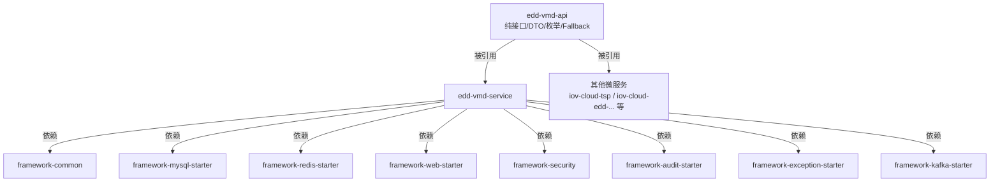
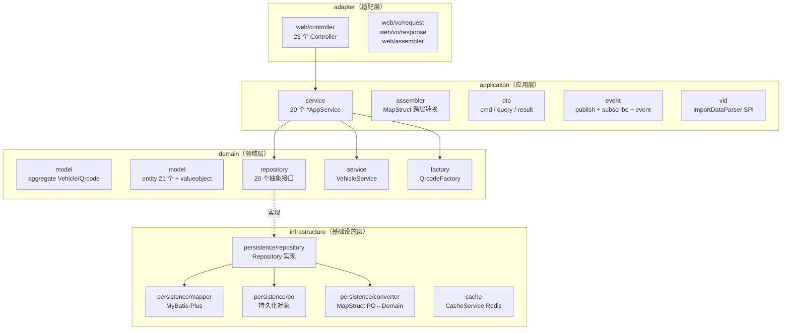
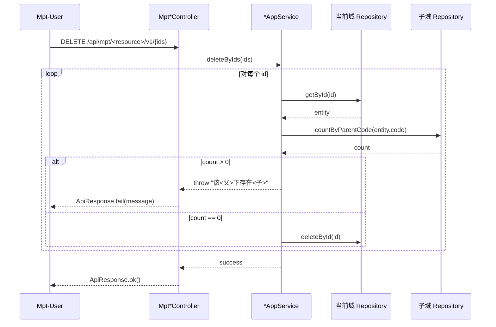
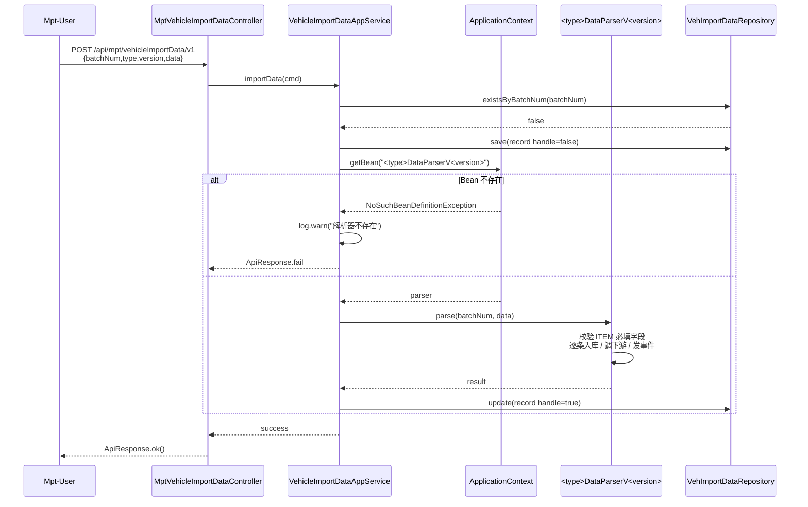
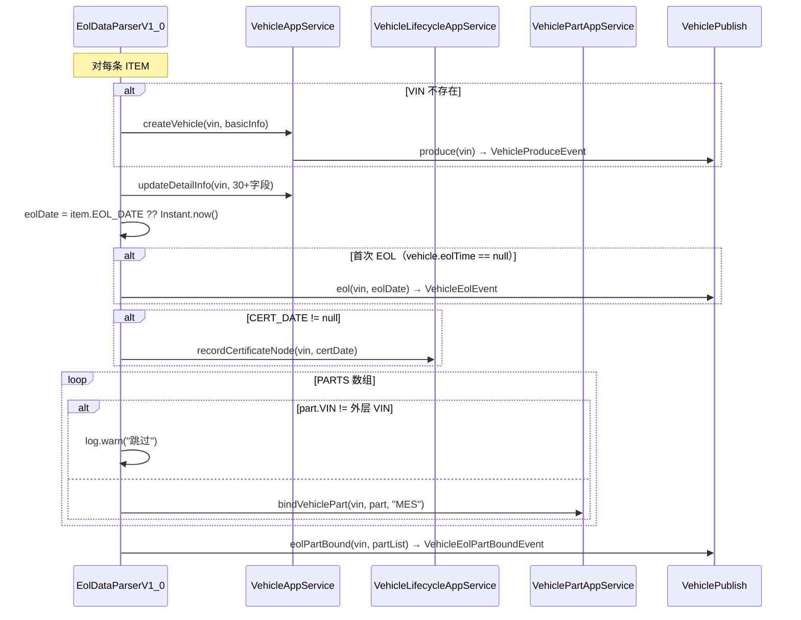
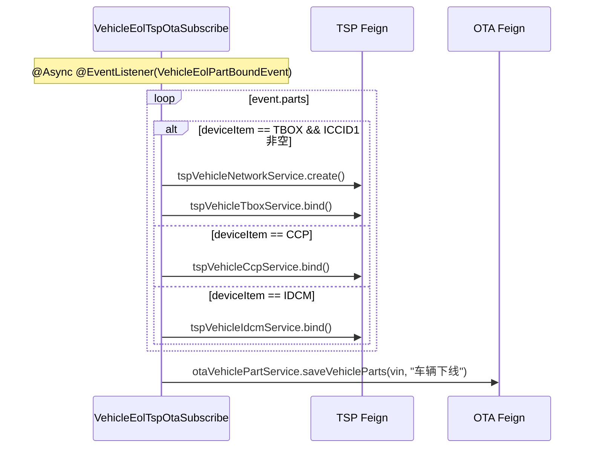
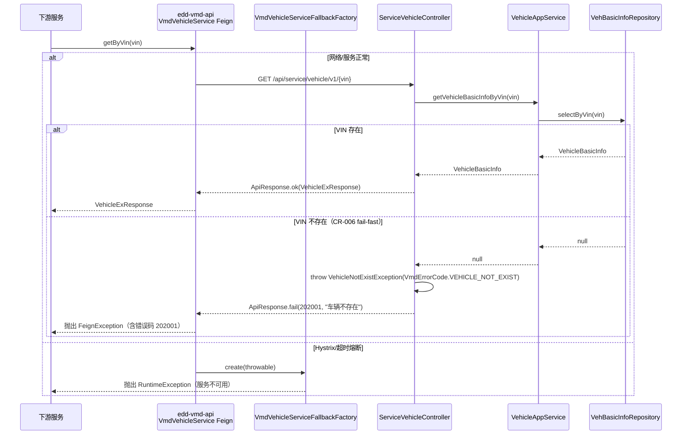

# Vehicle Master Data Platform - Design

> 本文档基于 `requirements.md` (CR-001 + CR-002) 产出。所有章节通过 §6 Coverage Mapping 显式回链到 US-ID。
> 任何后续变更必须遵循 SPEC_GUIDE §6 变更管理规则。

## 1. Architecture Overview

### 1.1 系统上下文

```mermaid
graph LR
    subgraph "上游调用方"
        MPT[Mpt 后台<br/>completeVehicle:* / iov:configCenter:*]
        TSP_C[TSP 服务<br/>记录证书/密钥节点]
        OTH_C[其他下游<br/>OTA/订单/账号 等]
    end

    GW[API Gateway<br/>鉴权/限流/审计]

    subgraph "edd-vmd 微服务"
        API[edd-vmd-api<br/>Feign 契约 + Fallback]
        SVC[edd-vmd-service<br/>DDD 四层实现]
    end

    subgraph "下游调用方（被 edd-vmd 主动调用）"
        TSP_D[TSP 服务<br/>TspVehicleNetwork/Tbox/Ccp/Idcm/...]
        OTA[OTA 服务<br/>OtaVehiclePartService]
        IDK[IDK 服务<br/>IdkBtmInfoService]
        ACC[(账号服务<br/>ExAccountService<br/>当前注释)]
        SK[(安全密钥服务<br/>ExSkService<br/>当前注释)]
    end

    subgraph "基础设施"
        MYSQL[(MySQL 8<br/>Flyway 管理)]
        REDIS[(Redis<br/>缓存)]
        NACOS[(Nacos<br/>注册 + 配置)]
    end

    MPT --> GW
    GW --> SVC
    TSP_C -.Feign.-> API
    OTH_C -.Feign.-> API
    API -.routing.-> SVC

    SVC --> TSP_D
    SVC --> OTA
    SVC --> IDK
    SVC -.x.-> ACC
    SVC -.x.-> SK

    SVC --> MYSQL
    SVC --> REDIS
    SVC --> NACOS
```

### 1.2 模块依赖



### 1.3 DDD 四层



**强分层规则**（PROJECT_GUIDE 硬性约束）：
- adapter 仅依赖 application，禁止直接依赖 domain/infrastructure
- application 仅依赖 domain，禁止持有 PO
- domain 不依赖任何外部框架（仅依赖 framework-common 中的基类如 `BaseDo` / `DomainObj`）
- infrastructure 实现 domain.repository 接口，对外只暴露领域对象

## 2. Tech Stack & Decisions

| # | Decision | Choice | Alternatives | Rationale |
|---|----------|--------|--------------|-----------|
| D1 | 运行时 | JDK 17 | JDK 11 / JDK 21 | 与 `iov-cloud-parent` 父 POM 锁定一致；JDK 17 LTS，支持 record / pattern matching；项目已固化于 `/Library/Java/JavaVirtualMachines/jdk-17.0.1.jdk` |
| D2 | 微服务注册/配置中心 | Nacos（namespace `32c13f29-...`）| Eureka / Consul | 与 `iov-cloud-*` 全家桶统一；支持 namespace 隔离 + 共享 yaml（application/mysql/redis）；`bootstrap.yml` 已锁定 |
| D3 | ORM | MyBatis-Plus + Flyway | JPA / Hibernate | 框架层 `framework-mysql-starter` 已绑定 MyBatis-Plus；SQL 可控；Flyway V0/V1/V2 已落库 |
| D4 | 跨层对象转换 | MapStruct（编译期生成） | BeanUtils / 手写 | 编译期检查 + 零反射，已在 `application/assembler` 与 `infrastructure/persistence/converter` 全面使用 |
| D5 | 架构模式 | DDD 四层 + 仓储模式 | 贫血三层（Controller/Service/DAO） | PROJECT_GUIDE 硬性要求；聚合 `Vehicle`/`Qrcode` 自带行为（如 `bindOrder`、`validate`、`confirm`），避免逻辑下沉到 Service |
| D6 | 分页策略 | PageHelper `startPage()` + `getPageResult()`，下沉 SQL `LIMIT` | `findAll()` + 内存分页 / 自写 OFFSET | PROJECT_GUIDE 反向模式禁止内存分页；MPT 列表需稳定性能 |
| D7 | 域内事件分发 | Spring `ApplicationEventPublisher`（同进程） | Kafka 跨进程异步 | 当前事件链路均在 edd-vmd 内部；生命周期节点写入（PRODUCE/EOL）使用同步 `@EventListener` 确保事务一致性；**EOL 解析器对 TSP/OTA 的下游调用通过 `VehicleEolPartBoundEvent` + `@Async @EventListener` 异步解耦**，下游不可用时不阻塞 EOL 主流程；未来可平滑迁移至 Kafka |
| D8 | 二维码过期机制 | **当前为空实现（已知缺陷，对应 §5 O9）**；`Qrcode.polling()` 方法体仅含注释 "由于 createTime 已移除，polling 逻辑需依赖基础设施层或重新设计，此处暂时移除超时逻辑，待后续完善"；`QrcodeType.VEHICLE_ACTIVE.timeout=1800` 字段已在 `edd-vmd-api` 定义但未被消费 | ① Redis TTL（Key 自动过期） ② 数据库定时扫表 ③ Qrcode 表加 `expireTime` 列 | Rationale：本 spec 为代码现状基线，仅记录缺陷形态，不规定修复方式。备选项均不在当前代码中体现 |
| D9 | 导入解析器 SPI | Spring Bean Name 命名约定 + `applicationContext.getBean("<type>DataParserV<version>")` | ① ServiceLoader ② 显式注册表 ③ 策略枚举 | 已存在 7 个解析器（`produceDataParserV1.0` 等）；新增解析器只需注册 Bean，零侵入；命名约定支持版本切换（V2.0 时不破坏 V1.0） |
| D10 | Feign 契约策略（**CR-006 修订**） | 强类型 DTO + `*FallbackFactory` + VIN 不存在抛 `VehicleNotExistException` | 返回 `null` / 返回 `Optional<T>` | **fail-fast 原则**：VIN 不存在时抛 `VehicleNotExistException`（`VmdErrorCode.VEHICLE_NOT_EXIST`，错误码 `202001`），由 `GlobalExceptionHandler` 统一捕获返回 `ApiResponse.fail`；`VmdBaseException` 继承 `BusinessException` 以纳入框架统一异常处理链路；Fallback 仅处理基础设施故障（网络/超时），此时抛 `RuntimeException` 让调用方感知服务不可用 |
| D11 | `Vehicle.isActive()` 实现 | **硬编码 `return true`（已知缺陷，对应 §5 O6）**；导致所有 VIN 在 `generateActiveQrcode` 都被判定为已激活并抛 `VehicleHasActivatedException` | ① 查询 `VehicleLifecycleNode` 表是否存在 `VEHICLE_ACTIVE` 节点 ② 通过 qrcode CONFIRMED 判定 ③ 在 `Vehicle` 表加 `active` 状态列 | Rationale：本 spec 为代码现状基线，仅记录缺陷形态。激活的真实判定规则未在当前代码中实现 |
| D12 | IMMO_SK 死代码现状 | `VehicleSkSubscribe` 类整体注释 + `ExSkService` import 注释 + 事件订阅方法体注释；`recordGenerateVehicleSkNode` 永不被触发 | — | Rationale：本 spec 为代码现状基线，仅记录现状形态（死代码保留），不规定处理方式（删除/恢复/标 Deprecated 等改造均需走单独 CR） |

## 3. Data Model

### 3.1 持久化表清单（23 张）

按业务域分组，所有表通过 Flyway V0/V1/V2 创建（V3 由本 design 引入）。

#### 产品树域（10 张）
| 表名 | PO 类 | 关键列 | 唯一约束 | 关联 |
|------|------|--------|----------|------|
| `veh_brand` | `VehBrandPo` | `code`, `name` | UK(`code`) | — |
| `veh_series` | `VehSeriesPo` | `code`, `name`, `brand_code` | UK(`code`) | → `veh_brand.code` |
| `veh_platform` | `VehPlatformPo` | `code`, `name` | UK(`code`) | — |
| `veh_model` | `VehModelPo` | `code`, `name`, `platform_code`, `series_code` | UK(`code`) | → `veh_platform.code`, `veh_series.code` |
| `veh_base_model` | `VehBaseModelPo` | `code`, `name`, `platform_code`, `series_code`, `model_code` | UK(`code`) | → `veh_model.code` |
| `veh_base_model_feature_code` | `VehBaseModelFeatureCodePo` | `base_model_code`, `family_code`, `feature_code` | UK(`base_model_code`,`family_code`) | → `veh_base_model.code`, `veh_feature_family.code`, `veh_feature_code.code` |
| `veh_build_config` | `VehBuildConfigPo` | `code`, `name`, `base_model_code` | UK(`code`) | → `veh_base_model.code` |
| `veh_build_config_feature_code` | `VehBuildConfigFeatureCodePo` | `build_config_code`, `family_code`, `feature_code` | UK(`build_config_code`,`family_code`) | → `veh_build_config.code` |
| `veh_feature_family` | `VehFeatureFamilyPo` | `code`, `name`, `type` | UK(`code`) | — |
| `veh_feature_code` | `VehFeatureCodePo` | `code`, `name`, `family_code` | UK(`code`) | → `veh_feature_family.code` |
| `veh_manufacturer` | `VehManufacturerPo` | `code`, `name` | UK(`code`) | — |

#### 配置项域（3 张）
| 表名 | PO 类 | 关键列 | 唯一约束 |
|------|------|--------|----------|
| `config_item` | `ConfigItemPo` | `code`, `name` | UK(`code`) |
| `config_item_option` | `ConfigItemOptionPo` | `config_item_code`, `option_code` | UK(`config_item_code`,`option_code`) |
| `config_item_mapping` | `ConfigItemMappingPo` | `config_item_code`, `source_value`, `target_value` | — |

#### 物理车域（5 张）
| 表名 | PO 类 | 关键列 | 唯一约束 | 备注 |
|------|------|--------|----------|------|
| `veh_basic_info` | `VehBasicInfoPo` | `vin`, `manufacturer_code`, `brand_code`, `platform_code`, `series_code`, `model_code`, `base_model_code`, `build_config_code`, `order_num` | UK(`vin`) | 车辆主档 |
| `veh_detail_info` | `VehDetailInfoPo` | `vin`, 30+ 详细字段 | UK(`vin`) | EOL 解析时填充 |
| `veh_preset_owner` | `VehPresetOwnerPo` | `vin`, `mobile`, `name` | UK(`vin`) | 预设车主（当前 `checkVehiclePresetOwner` 注释，本期不消费） |
| `vehicle_config` | `VehicleConfigPo` | `vin`, `version` | UK(`vin`,`version`) | 车辆配置版本 |
| `vehicle_config_item` | `VehicleConfigItemPo` | `vin`, `version`, `config_item_code`, `value` | UK(`vin`,`version`,`config_item_code`) | 车辆配置项 |

#### 零件设备供应商域（5 张）
| 表名 | PO 类 | 关键列 | 唯一约束 |
|------|------|--------|----------|
| `part` | `PartPo` | `pn`, `name`, `type`, `device_code`, `supplier_code`, `software` | UK(`pn`) |
| `device` | `DevicePo` | `code`, `name`, `device_item`, `software` | UK(`code`) |
| `supplier` | `SupplierPo` | `code`, `name` | UK(`code`) |
| `vehicle_part` | `VehiclePartPo` | `vin`, `pn`, `sn`, `device_code`, `device_item`, `part_state`, `bind_org`, `bind_time`, `extra` | UK(`pn`,`sn`) |
| `vehicle_part_history` | `VehiclePartHistoryPo` | 同 `vehicle_part` + `change_time` | — |

#### 生命周期域（2 张）
| 表名 | PO 类 | 关键列 | 唯一约束 | 备注 |
|------|------|--------|----------|------|
| `veh_lifecycle` | `VehLifecyclePo` | `vin` | UK(`vin`) | 生命周期主表（聚合） |
| （生命周期节点） | （隐含在 `veh_lifecycle` 关联或独立表） | `vin`, `node_code`, `reach_time` | UK(`vin`,`node_code`) | 单节点最多写入一次（首次申请语义） |

> 注：`VehLifecycleRepository` 提供 `physicalDeleteByVin(vin)`；节点写入通过 `VehicleLifecycleNodeRepository.save()`。

#### 导入域（1 张）
| 表名 | PO 类 | 关键列 | 唯一约束 |
|------|------|--------|----------|
| `veh_import_data` | `VehImportDataPo` | `batch_num`, `type`, `version`, `data`(JSON), `handle` | UK(`batch_num`) |

### 3.2 领域模型

#### 聚合根（Aggregate）
- **`Vehicle`**（`domain/model/aggregate/Vehicle.java`）：物理车辆根聚合
  - 内含：`VehicleBasicInfo` + `VehicleDetail` + `VehiclePresetOwner` + 关联 `VehicleConfig` + 关联 `VehiclePart` 列表
  - 行为：`bindOrder(orderNum)`

#### 实体（Entity，21 个）
按 §3.1 表清单一一对应，关键实体：`Brand` / `Series` / `Platform` / `Model` / `BaseModel` / `BaseModelFeatureCode` / `BuildConfig` / `BuildConfigFeatureCode` / `FeatureFamily` / `FeatureCode` / `Manufacturer` / `ConfigItem` / `ConfigItemOption` / `ConfigItemMapping` / `VehicleBasicInfo` / `VehicleDetail` / `VehiclePresetOwner` / `VehicleConfig` / `VehicleConfigItem` / `VehiclePart` / `VehiclePartHistory` / `Part` / `Device` / `Supplier` / `VehicleLifecycle` / `VehicleLifecycleNode` / `VehicleImportData`

#### 值对象（Value Object）
- **`VehicleLifecycleNodeEnum`**：23 个节点（包含拼写错误 `VEHICLE_INVoICING`，参见 §5 O10 已知缺陷）
- **`VehiclePartState`**：`0=作废 / 1=在用` 等
- **`MnoType`**：SIM 卡运营商枚举（`CMCC` / `CTCC` / `CUCC` 等，由 SIM 解析器使用）
- **`DeviceItem`**：设备项类型（`TBOX` / `CCP` / `IDCM` / `BTM` 等）

### 3.3 跨层 DTO 一览

| 层 | 包路径 | 数量 | 命名规范 |
|----|--------|------|----------|
| Adapter | `adapter/web/vo/request` | 27 | `*Request.java` |
| Adapter | `adapter/web/vo/response` | 27 | `*Response.java` |
| Application | `application/dto/cmd` | 24 | `*Cmd.java`（写入命令） |
| Application | `application/dto/query` | 19 | `*Query.java`（查询条件） |
| Application | `application/dto/result` | 26 | `*Dto.java`（领域→应用结果） |
| API | `edd-vmd-api/vo/response` | 7 | `*ExResponse / *Response.java`（Feign 出参） |
| API | `edd-vmd-api/vo/request` | 2 | `*ExRequest.java`（Feign 入参） |

### 3.4 Flyway 迁移版本

| 版本 | 文件 | 说明 |
|------|------|------|
| V0 | `V0__Baseline.sql` | 基线（23 张表 + 索引 + 默认数据） |
| V1 | `V1__BuildConfig_feature_code_migration.sql` | 生产配置特征值迁移 |
| V2 | `V2__Series_brand_code_migration.sql` | 车系冗余 brand_code |

## 4. Core Flows

### 4.1 F1 - MPT 维护产品树（删除前置依赖检查）



**对应 US**：US-001 ~ US-009、US-014 ~ US-016。

### 4.2 F2 - 导入数据解析（动态 SPI 选择解析器）



**对应 US**：US-018 ~ US-025。

### 4.3 F3 - EOL 解析联动生命周期 + 发布零件绑定事件



**异步订阅者（VehicleEolTspOtaSubscribe）**：


**事件订阅副作用**：
- `VehicleLifecycleSubscribe.onProduce(event)` → `recordProduceNode(vin)`
- `VehicleLifecycleSubscribe.onEol(event)` → `recordEolNode(vin, event.eolTime)`
- `VehicleSkSubscribe.onProduce(event)` → **当前注释，不生效**（D12 / O7）

**对应 US**：US-019 ~ US-020、US-026。

### 4.4 F4 - Service 端 Feign 调用链路



**对应 US**：US-011、US-012、US-014（pn 查询）、US-015（code 查询）、US-027、US-030、US-031。

### 4.5 F5 - 内部事件订阅链路总览

```mermaid
graph LR
    subgraph "Publisher（应用层）"
        VPub[VehiclePublish<br/>produce/eol/eolPartBound]
    end

    subgraph "Event"
        E1[VehicleProduceEvent]
        E2[VehicleEolEvent]
        E3[VehicleEolPartBoundEvent]
    end

    subgraph "Subscriber"
        S1[VehicleLifecycleSubscribe<br/>onProduce → PRODUCE 节点<br/>onEol → EOL 节点]
        S2["VehicleSkSubscribe<br/>onProduce → IMMO_SK 节点<br/>(整体注释，O7)"]
        S3[VehicleEolTspOtaSubscribe<br/>@Async onEolPartBound<br/>→ TSP bind + OTA sync]
    end

    VPub --> E1
    VPub --> E2
    VPub --> E3

    E1 --> S1
    E1 -.x.-> S2
    E2 --> S1
    E3 --> S3
```

**对应 US**：US-026、US-019（PRODUCE 事件）、US-020（EOL 事件 + 零件绑定事件）。

## 5. API Contracts

> 颗粒度策略：MPT 给完整 schema（method + path + 权限 + 关键字段），Service 端因 `edd-vmd-api` 是契约源，仅给签名 + 错误码 + Fallback 行为。

### 5.1 MPT 端（`/api/mpt/**`，权限点前缀 `completeVehicle:` 或 `iov:configCenter:`）

#### 5.1.1 Brand `MptBrandController`（→ US-001）
| Method | Path | Permission | Request | Response |
|--------|------|-----------|---------|----------|
| GET | `/api/mpt/brand/v1/list` | `completeVehicle:product:brand:list` | `BrandRequest`（code/name/beginTime/endTime） | `PageResult<BrandResponse>` |
| GET | `/api/mpt/brand/v1/listAll` | `completeVehicle:product:brand:list` | — | `List<BrandResponse>` |
| GET | `/api/mpt/brand/v1/{brandId}` | `completeVehicle:product:brand:query` | — | `BrandResponse` |
| POST | `/api/mpt/brand/v1` | `completeVehicle:product:brand:add` | `BrandRequest` | `ApiResponse<Long>` |
| PUT | `/api/mpt/brand/v1` | `completeVehicle:product:brand:edit` | `BrandRequest` | `ApiResponse<Boolean>` |
| DELETE | `/api/mpt/brand/v1/{brandIds}` | `completeVehicle:product:brand:remove` | path `Long[]` | `ApiResponse<Boolean>` |
| POST | `/api/mpt/brand/v1/export` | `completeVehicle:product:brand:export` | `BrandRequest` | `Excel/CSV stream`（O5：未实现，仅日志） |

错误：`code 已存在` / `该品牌下存在车系` / `该品牌下存在车辆`

#### 5.1.2 Series `MptSeriesController`（→ US-002）
完整 7 端点同 5.1.1 模式，权限前缀 `completeVehicle:product:series:*`，**额外**：
| Method | Path | Description |
|--------|------|-------------|
| GET | `/api/mpt/series/v1/listByBrandCode` | 入参 `brandCode`，返回该品牌下全部车系（不分页） |

错误：`code 已存在` / `该车系下存在车型` / `该车系下存在车辆`

#### 5.1.3 Model `MptModelController`（→ US-003）
完整 7 端点 + 额外：
| Method | Path | Description |
|--------|------|-------------|
| GET | `/api/mpt/model/v1/listByPlatformCodeAndSeriesCode` | 入参 `platformCode`,`seriesCode`，返回交集 |

错误：`code 已存在` / `该车型下存在基础车型` / `该车型下存在车辆`

#### 5.1.4 BaseModel `MptBaseModelController`（→ US-004）
完整 7 端点 + 特征值嵌套子资源：
| Method | Path | Description |
|--------|------|-------------|
| GET | `/api/mpt/baseModel/v1/listByPlatformCodeAndSeriesCodeAndModelCode` | 任意三参数组合查询 |
| GET | `/api/mpt/baseModel/v1/{baseModelCode}/featureCode/list` | 查询基础车型下特征值 |
| POST | `/api/mpt/baseModel/v1/{baseModelCode}/featureCode` | 新增特征值 |
| PUT | `/api/mpt/baseModel/v1/{baseModelCode}/featureCode` | 修改特征值 |
| DELETE | `/api/mpt/baseModel/v1/{baseModelCode}/featureCode/{ids}` | 删除特征值 |

错误：`基础车型特征值已存在`（同 familyCode） / `该基础车型下存在生产配置/车辆`

#### 5.1.5 BuildConfig `MptBuildConfigController`（→ US-005）
完整 7 端点 + 子资源同 5.1.4 模式：
| Method | Path | Description |
|--------|------|-------------|
| GET | `/api/mpt/buildConfig/v1/listByBaseModelCode/{baseModelCode}` | 该基础车型下全部生产配置 |
| GET | `/api/mpt/buildConfig/v1/{buildConfigCode}/featureCode/list` | 配置下特征值列表 |
| POST | `/api/mpt/buildConfig/v1/{buildConfigCode}/featureCode` | 新增特征值 |
| PUT | `/api/mpt/buildConfig/v1/{buildConfigCode}/featureCode` | 修改特征值 |
| DELETE | `/api/mpt/buildConfig/v1/{buildConfigCode}/featureCode/{ids}` | 删除 |

错误：`生产配置特征值已存在` / `该生产配置下存在车辆`

#### 5.1.6 Platform `MptPlatformController`（→ US-006）
完整 7 端点 + `GET /listAll`。错误：`code 已存在` / `该平台下存在车系/车辆`。

#### 5.1.7 Manufacturer `MptManufacturerController`（→ US-007）
完整 7 端点。错误：`code 已存在` / `该生产厂商下存在车辆`。

#### 5.1.8 FeatureFamily `MptFeatureFamilyController`（→ US-008）
完整 7 端点 + 子资源：
| Method | Path | Description |
|--------|------|-------------|
| GET | `/api/mpt/featureFamily/v1/listAllFeatureCode` | 入参 `familyCode`，返回该族下全部特征值（不分页） |
| POST | `/api/mpt/featureFamily/v1/{familyCode}/featureCode` | 新增特征值 |
| PUT | `/api/mpt/featureFamily/v1/{familyCode}/featureCode` | 修改特征值 |
| DELETE | `/api/mpt/featureFamily/v1/{familyCode}/featureCode/{ids}` | 删除特征值 |

错误：`特征族 code 已存在` / `特征值 code 已存在`

#### 5.1.9 ConfigItem `MptConfigItemController`（→ US-009）
完整 7 端点 + 嵌套 Option / Mapping 子资源（CRUD ×2 = 8 端点）：
| Method | Path | Description |
|--------|------|-------------|
| GET | `/api/mpt/configItem/v1/listAll` | 全部配置项 |
| `*` | `/api/mpt/configItem/v1/{configItemCode}/option/**` | 枚举值 CRUD |
| `*` | `/api/mpt/configItem/v1/{configItemCode}/mapping/**` | 上下游映射 CRUD |

#### 5.1.10 Vehicle `MptVehicleController`（→ US-010）
| Method | Path | Permission | Description |
|--------|------|-----------|-------------|
| GET | `/api/mpt/vehicle/v1/list` | `completeVehicle:vehicle:vehicle:list` | 分页：`vin`(模糊)/`buildConfigCode`/时间窗 |
| GET | `/api/mpt/vehicle/v1/vin/{vin}` | `completeVehicle:vehicle:vehicle:query` | 完整 `Vehicle` 聚合 |
| DELETE | `/api/mpt/vehicle/v1/{ids}` | `completeVehicle:vehicle:vehicle:remove` | 联动删除 lifecycle |
| POST | `/api/mpt/vehicle/v1/export` | `completeVehicle:vehicle:vehicle:export` | （O5：未实现） |

#### 5.1.11 VehicleConfig `MptVehicleConfigController`（→ US-013）
| Method | Path | Permission |
|--------|------|-----------|
| GET | `/api/mpt/vehicleConfig/v1/list` | `iov:configCenter:vehicleConfig:list` |
| GET | `/api/mpt/vehicleConfig/v1/{vin}/configItem/list` | `iov:configCenter:vehicleConfig:query` |
| POST | `/api/mpt/vehicleConfig/v1/export` | `iov:configCenter:vehicleConfig:export` |

> 注：当前不暴露 add/edit（O8）。

#### 5.1.12 Part `MptPartController`（→ US-014）
完整 7 端点。过滤参数：`key/pn/name/type/deviceCode`。错误：`pn 已存在`。

#### 5.1.13 Device `MptDeviceController`（→ US-015）
完整 7 端点 + `GET /listAll` + `GET /listAllDeviceItem`（返回 `DeviceItem` 枚举）。

#### 5.1.14 Supplier `MptSupplierController`（→ US-016）
完整 7 端点。错误：`code 已存在`。

#### 5.1.15 VehiclePart `MptVehiclePartController`（→ US-017）
| Method | Path | Permission | 说明 |
|--------|------|-----------|------|
| GET | `/api/mpt/vehiclePart/v1/list` | `completeVehicle:vehicle:vehiclePart:list` | 分页 vin/pn/时间窗 |
| GET | `/api/mpt/vehiclePart/v1/{id}` | `:query` | — |
| POST | `/api/mpt/vehiclePart/v1` | `:add` | 当前未对 `vin` 做存在性校验（参见 §5 O11） |
| PUT | `/api/mpt/vehiclePart/v1` | `:edit` | 同上 |
| DELETE | `/api/mpt/vehiclePart/v1/{ids}` | `:remove` | — |
| POST | `/api/mpt/vehiclePart/v1/export` | `:export` | （O5） |

错误：`车辆零件已存在`(pn,sn)

#### 5.1.16 VehicleImportData `MptVehicleImportDataController`（→ US-018）
| Method | Path | Description |
|--------|------|-------------|
| GET | `/api/mpt/vehicleImportData/v1/list` | 分页：`batchNum/type/version/handle` |
| GET | `/api/mpt/vehicleImportData/v1/{id}` | — |
| POST | `/api/mpt/vehicleImportData/v1` | 提交批次（自动选择解析器） |
| DELETE | `/api/mpt/vehicleImportData/v1/{ids}` | — |

错误：`批次号已存在` / `解析器不存在` / `解析异常`

### 5.2 Service 端（`edd-vmd-api`，Feign 契约）

> 完整签名以 `edd-vmd-api/src/main/java/.../api/service/Vmd*Service.java` 为准；本节列契约清单 + 错误码 + Fallback 行为。

#### 5.2.1 `VmdVehicleService`（→ US-011/US-012）
- `VehicleExResponse getByVin(@PathVariable String vin)`
- `void bindOrder(@PathVariable String vin, @RequestBody VehicleOrderExRequest req)`

**Fallback 规范**：`VmdVehicleServiceFallbackFactory` → `getByVin` 抛 `RuntimeException`（服务不可用，让调用方感知故障）；`bindOrder` 不抛异常但记录熔断日志。

**错误码**：`VehicleNotExistException`（`VmdErrorCode.VEHICLE_NOT_EXIST`，错误码 `202001`，VIN 不存在时由 Service 端抛出，通过 `GlobalExceptionHandler` 返回 `ApiResponse.fail`）；`VehicleHasBindOrderException`（`VmdErrorCode.VEHICLE_HAS_BIND_ORDER`，错误码 `202009`，重复绑定订单）。

#### 5.2.2 `VmdVehicleLifecycleService`（→ US-027）
8 个 `recordFirstApply*Node` 端点（TBOX_CERT / TBOX_COMM_SK / CCP_CERT / CCP_COMM_SK / IDCM_CERT / IDCM_COMM_SK / ADCM_CERT / ADCM_COMM_SK）。

**Fallback**：所有方法 no-op + log。

#### 5.2.3 `VmdPartService`（→ US-014）
- `PartExResponse getByPn(@PathVariable String pn)`
- `List<PartExResponse> listAllFota(@RequestParam Boolean software)`

**Fallback**：返回 `null` / 空集合。

#### 5.2.4 `VmdDeviceService`（→ US-015）
- `DeviceExResponse getByCode(@PathVariable String code)`
- `List<DeviceExResponse> listAllFota()`

**Fallback**：同上。

#### 5.2.5 `VmdVehicleModelConfigService`（→ US-031）
- `String getBuildConfigCodeByFeatureCodes(@RequestParam Map<String,String> featureCodes)`
- `List<VmdBuildConfigResponse> listBuildConfigByBaseModelCode(@PathVariable String baseModelCode)`
- `VmdBuildConfigResponse getBuildConfig(@PathVariable String buildConfigCode)`

**Fallback**：`null` / 空集合；`getBuildConfig` 在 `seriesCode` 缺失时省略 `brandCode`（不视为错误，US-031 验收要求）。

### 5.3 错误码总表

> VMD 异常体系：`VmdBaseException` → `BusinessException`（`framework-common`），由 `GlobalExceptionHandler` 统一捕获，HTTP 状态码 `200`，响应体为 `ApiResponse.fail(VmdErrorCode, message)`。

| 异常类 | 错误码 | HTTP | 触发场景 | 用户消息 |
|--------|--------|------|---------|---------|
| `VehicleNotExistException` | `202001` | 200 | VIN 不存在 | `车辆不存在` |
| `VehicleHasBindOrderException` | `202009` | 200 | 重复绑定订单 | `车辆已绑定订单` |
| `VehicleImportDataException` | `202010` | 200 | 导入解析失败 | `车辆导入数据异常` |
| `PartNotExistException` | `202011` | 200 | PN 不存在 | `零件不存在` |
| `PartNotAllowBindException` | `202012` | 200 | 零件不允许绑定 | `零件不允许绑定` |

## 6. Coverage Mapping

| US-ID | Design Section | Note |
|-------|----------------|------|
| US-001 Brand | §3.1 产品树 / §4.1 F1 / §5.1.1 | 完整 CRUD + 删除前置依赖 |
| US-002 Series | §3.1 产品树 / §4.1 F1 / §5.1.2 | 含 `listByBrandCode` |
| US-003 Model | §3.1 产品树 / §4.1 F1 / §5.1.3 | 含平台+车系联合查询 |
| US-004 BaseModel + 特征值 | §3.1 产品树 / §4.1 F1 / §5.1.4 | 含特征值嵌套子资源 |
| US-005 BuildConfig + 特征值 | §3.1 产品树 / §4.1 F1 / §5.1.5 | 含特征值嵌套子资源 |
| US-006 Platform | §3.1 产品树 / §4.1 F1 / §5.1.6 | + listAll |
| US-007 Manufacturer | §3.1 产品树 / §4.1 F1 / §5.1.7 | — |
| US-008 FeatureFamily + Code | §3.1 产品树 / §4.1 F1 / §5.1.8 | 含族下特征值 listAll |
| US-009 ConfigItem + Option + Mapping | §3.1 配置项 / §4.1 F1 / §5.1.9 | 嵌套子资源 |
| US-010 Vehicle CRUD（MPT） | §3.1 物理车 / §3.2 Vehicle 聚合 / §5.1.10 | 删除联动 lifecycle |
| US-011 Vehicle 内部查询 | §3.2 Vehicle / §4.4 F4 / §5.2.1 / D10 | VIN 不存在抛 `VehicleNotExistException`（fail-fast） |
| US-012 Vehicle 订单绑定 | §3.2 Vehicle.bindOrder / §5.2.1 | + ORDER_BIND 节点 |
| US-013 VehicleConfig | §3.1 物理车 / §5.1.11 | 仅查询/导出（O8） |
| US-014 Part | §3.1 零件 / §5.1.12 / §5.2.3 | MPT + Service 双暴露 |
| US-015 Device | §3.1 零件 / §5.1.13 / §5.2.4 | MPT + Service 双暴露 |
| US-016 Supplier | §3.1 零件 / §5.1.14 | — |
| US-017 VehiclePart | §3.1 零件 / §5.1.15 | 当前未做 VIN 校验（O11 已知缺陷） |
| US-018 VehicleImportData | §4.2 F2 / §5.1.16 | SPI 解析器调度 |
| US-019 PRODUCE 解析器 | §4.2 F2 / §3.2 VehiclePublish.produce / §4.5 F5 | 触发 VehicleProduceEvent |
| US-020 EOL 解析器 | §4.3 F3 / §4.5 F5 | 联动 TSP/OTA + 详细字段入库 |
| US-021 BTM 解析器 | §4.2 F2 / §3.1 VehiclePart | 调 IDK |
| US-022 TBOX 解析器 | §4.2 F2 / §3.1 VehiclePart | 调 TSP |
| US-023 CCP 解析器 | §4.2 F2 / §3.1 VehiclePart | 调 TSP |
| US-024 IDCM 解析器 | §4.2 F2 / §3.1 VehiclePart | 调 TSP |
| US-025 SIM 解析器 | §4.2 F2 / §3.2 MnoType | 调 TSP |
| US-026 VehicleLifecycle | §3.2 23 个枚举 / §4.5 F5 | `VEHICLE_INVoICING` 拼写错误（O10）；IMMO_SK 写入暂不生效（O7） |
| US-027 服务端记录证书/密钥节点 | §5.2.2 8 端点 | + Fallback no-op |
| US-030 5 个 Vmd*Service Feign 契约 | §1.2 模块依赖 / §5.2 全 5 接口 / §4.4 F4 | + FallbackFactory ×5 |
| US-031 反查生产配置 | §5.2.5 / §3.1 BuildConfig | 任意特征值组合查询 |

## 7. Known Defects & Technical Debt

> 本 spec 为代码现状的逆向基线，本节描述代码中发现但未规定修复方式的已知缺陷与技术债。任何修复必须走 SPEC_GUIDE §6 变更管理（新建 CR）。

| ID | 位置 | 现状 | 影响 |
|----|------|------|------|
| TD-1 | `domain/model/valueobject/VehicleLifecycleNodeEnum.java:50` | 枚举值名 `VEHICLE_INVoICING`（小写 `o`） | 拼写错误；grep 验证当前无消费方，DB 中也无该值实例 |
| TD-2 | `application/event/subscribe/VehicleSkSubscribe.java` | 整个类 `ExSkService` 字段、import、`onVehicleProduceEvent` 方法体均被注释 | `IMMO_SK` 节点写入触发器永不执行；该节点定义为死分支 |
| TD-3 | `adapter/web/controller/mpt/MptVehiclePartController.java` add/edit | 未对 `vin` 做存在性校验 | 可创建无主车辆零件记录（脏数据风险） |
| TD-4 | 全部 `*Controller.export()` | 仅有 `@Log` 注解和日志，无 Excel/CSV 流响应 | 导出端点不可用（O5） |
| TD-5 | `adapter/web/controller/mpt/MptVehicleConfigController` | 仅 list / 查询配置项 / export，无 add / edit | 车辆配置无法通过 MPT 写入（O8） |

## 8. Open Questions

无（本 spec 为代码现状基线，所有已识别歧义与未来改造均归类至 §7 Known Defects 或 requirements §5 Out of Scope）。

## 9. Changelog

| Date | Change ID | Type | Description |
|------|-----------|------|-------------|
| 2026-05-23 | CR-001 | Added | 基于 requirements CR-001/CR-002 产出 design 首版（含改造意图） |
| 2026-05-23 | CR-002 | Modified | **回退首版中夹带的"未来改造"内容，回归纯逆向基线**：D8/D11/D12 改写为现状描述（不规定修复方式）；§3.4 移除 V3 迁移；§3.2 Vehicle 聚合行为标注当前缺陷而非改造方案；§5.1.15 移除 OQ 决议改造标注；§7 由"Impact Analysis"改写为"Known Defects & Technical Debt"；§8 Open Questions 清空。本 spec 自此为代码现状的正本 |
| 2026-05-23 | CR-003 | Removed | **移除 US-028/US-029 车机+移动端二维码激活闭环**：移除 §3.2 Qrcode 聚合、§4.4 F4 序列图、§5.2 IDCM 端、§5.3 Mobile 端、§5.5 错误码表中 Qrcode 相关条目、§6 Coverage Mapping US-028/US-029 行、§7 TD-1/TD-2/TD-5；§4.5 F5 事件订阅图移除 QrcodePublish/QrcodeValidateEvent/QrcodeConfirmEvent |
| 2026-05-23 | CR-004 | Modified | **US-020 EOL 解析器改事件驱动**：D7 决策更新（EOL 对 TSP/OTA 调用改为 `@Async @EventListener`）；§4.3 F3 时序图重构（EOL parser 只负责数据入库 + 发布 `VehicleEolPartBoundEvent`，TSP/OTA 调用移至 `VehicleEolTspOtaSubscribe`）；§4.5 F5 事件图新增 `VehicleEolPartBoundEvent` 及其订阅者 |
| 2026-05-23 | CR-006 | Modified | **US-011 VIN 不存在改为抛异常（fail-fast）**：D10 决策从"返回 null"改为"抛 `VehicleNotExistException`"；§4.4 F4 时序图更新（VIN 不存在时 Service 端抛异常 + Fallback 改为抛 RuntimeException）；§5.2.1 Fallback 规范更新；§5.3 错误码总表更新（新增 `VmdErrorCode` 错误码列、HTTP 状态码统一为 200、移除 `VmdBaseException` 基类行）；异常体系重构：`VmdBaseException` 从 `extends BaseException` 改为 `extends BusinessException`，新增 `VmdErrorCode` 枚举 |
